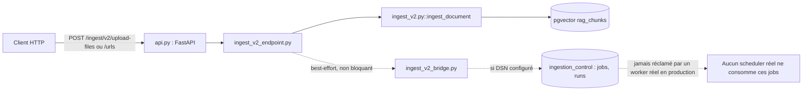
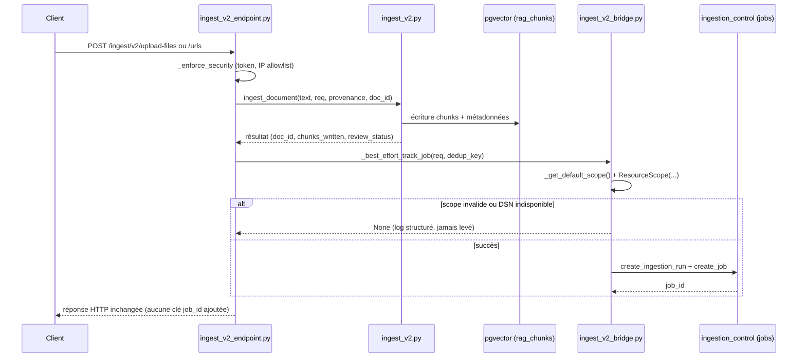
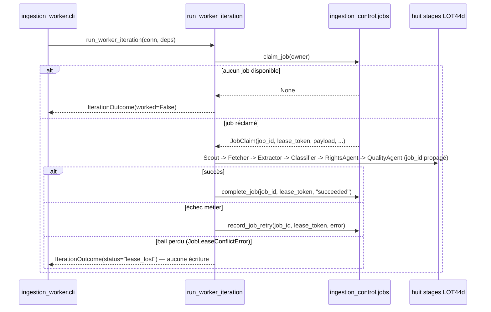
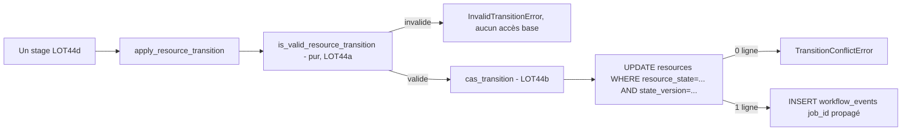
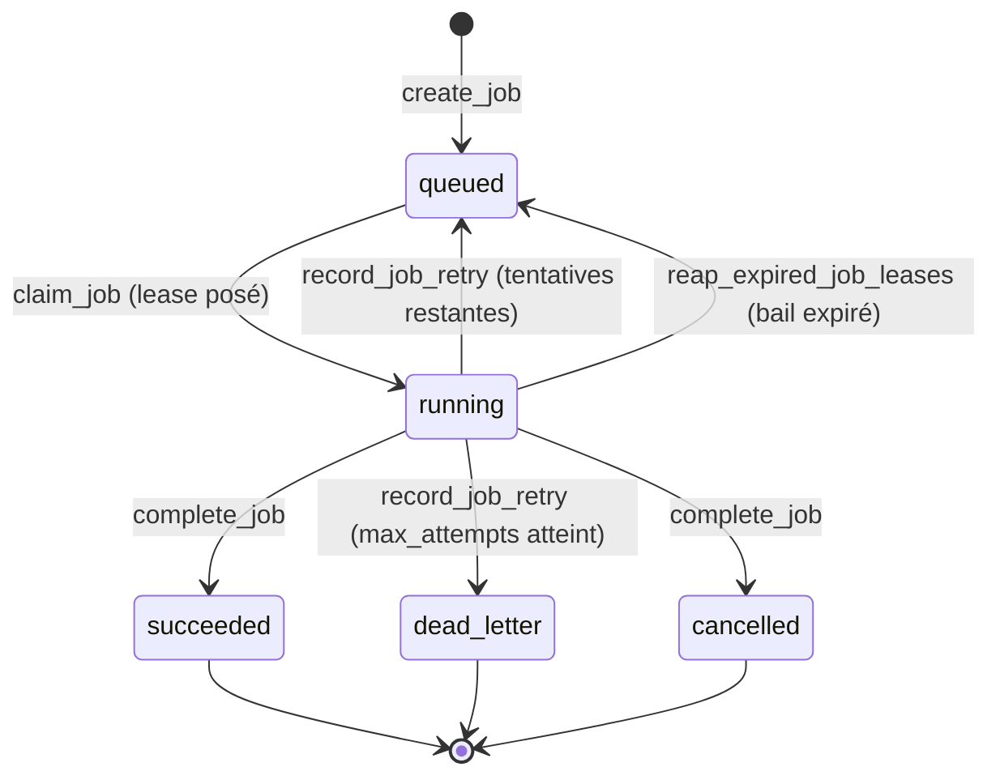

# État global du projet RAG — Documentation exhaustive et autosuffisante

**Document de référence unique** produit sur demande explicite de pilotage, en dehors de tout lot numéroté. Ce rapport est un audit transversal, pas une implémentation : aucun fichier de code, test, migration, configuration, Docker, API ou ADR n'a été modifié pour le produire ni pour ses passes de correction ultérieures. Seul ce fichier a été créé et modifié.

## Historique des passes sur ce document (pour lever toute ambiguïté temporelle)

Ce rapport a été produit puis corrigé en plusieurs missions distinctes. Toute expression « cette passe »/« cette mission » ci-dessous doit être lue au regard de cette chronologie :

1. **Passe d'audit initiale** — création du rapport, snapshot Git complet et exécution réelle des suites de tests (`pytest -q -m "not integration"`, `pytest tests/integration/`, `ruff`, `mypy`) rapportées section 11.1. C'est cette passe, et uniquement celle-ci, qui constitue l'exécution fraîche des suites de tests référencée dans tout le document.
2. **Première mission corrective** — reformulation des marqueurs de fiabilité, correction de l'inventaire LOT44c, correction (partielle à l'époque) de `jobs.status`, aucune ré-exécution de suite de tests.
3. **Deuxième mission corrective** — nouvelle réconciliation documentaire, aucune ré-exécution de suite de tests non plus (hors commandes de diagnostic Git/Markdown/chemins listées section 17) ; vérification directe et fraîche de la contrainte SQL réelle de `jobs.status`.
4. **Passes de correction et d'harmonisation documentaire ultérieures** — plusieurs passes supplémentaires ont suivi (corrections de comptages de verdicts, de formulations sur l'inventaire LOT44c, de la chronologie de la section 17, de l'auto-référence des valeurs de taille/nombre de lignes, et la présente harmonisation de cet historique). Toutes strictement documentaires : aucune n'a modifié de code, de test, de migration, de configuration ou d'ADR, aucune n'a relancé de suite de tests ni de campagne LOT44c. Le nombre exact de ces passes n'est volontairement pas énuméré ici pour ne pas introduire une numérotation non tracée par ailleurs dans ce document ; ce qui compte est que chacune d'elles, y compris la présente, reste postérieure à la passe d'audit initiale et ne constitue jamais une nouvelle exécution de test.

Sauf mention explicite contraire, toute exécution de suite de tests documentée dans ce rapport provient de la **passe d'audit initiale** (1), jamais d'une mission corrective ou d'une passe d'harmonisation ultérieure (2 et toutes les suivantes, y compris la présente), qui n'ont relancé aucune campagne de tests.

## Légende de fiabilité (utilisée dans tout le document)

| Marqueur | Signification |
|---|---|
| `VERIFIED_THIS_PASS` | Vérifié directement par une commande exécutée pendant la passe désignée par le contexte immédiat (commande et sortie publiées) — pour une exécution de suite de tests, désigne toujours la passe d'audit initiale (1) sauf mention contraire explicite |
| `REPORTED_PREVIOUSLY` | Annoncé dans un rapport/ADR antérieur à ce document, ou dans une passe antérieure de ce même document, non revérifié dans la passe courante |
| `NOT_RUN_THIS_PASS` | Campagne de test ciblée, revue détaillée ou commande non exécutée/relancée dans la passe désignée par le contexte immédiat — n'implique aucun jugement sur le résultat, seulement l'absence de ré-exécution |
| `INFERRED` | Déduit par recoupement de plusieurs éléments vérifiés ou rapportés, sans vérification directe unique |
| `UNKNOWN` | Non démontré, dans un sens ou dans l'autre |
| `BLOCKED` | Impossible à valider à cause d'une dépendance ou d'un verrou (ex. gouvernance LOT44c) |

Aucune affirmation de ce document ne repose sur la seule mémoire conversationnelle d'un rapport antérieur sans être marquée comme telle. Aucune relecture statique de code n'est présentée comme une preuve d'exécution.

---

## 0. Snapshot initial

### 0.1 Identité et horodatage

```
$ date "+%Y-%m-%d %H:%M:%S %Z"
2026-08-04 19:58:40 CET
$ pwd
/home/alaeddine/Bureau/RAG
$ git rev-parse --show-toplevel
/home/alaeddine/Bureau/RAG
$ git branch --show-current
lot-44d-ingestion-agents
```
`VERIFIED_THIS_PASS`

### 0.2 Chaîne de commits vérifiée dans Git (pas supposée)

```
$ git rev-parse HEAD
b6880874ca9d02f71634fec0ddfd3a5a139e5dd0
$ git rev-parse HEAD^
7da6d3d8f2cbd966231b756dbbb8064b136dadab
$ git rev-parse HEAD^^
f444d94f41541ab10439f13a6d0482de0270f09c
$ git rev-parse HEAD^^^
30fec2805e411a59e483ee3cb480ac55d6fc01a2
$ git log --oneline -10
b688087 feat(ingestion-worker): add scheduler/worker, job_id propagation, best-effort /ingest/v2 wiring (LOT44e phase 2)
7da6d3d feat(ingestion-control): add jobs table and primitives (LOT44e phase 1)
f444d94 feat(ingestion-agents): add LOT44d deterministic stages
30fec28 feat(ingestion-control): add PostgreSQL control plane primitives
75ee537 feat(contracts): add canonical ingestion contracts
ac8bc10 rag-engine: clôturer le hardening P1 (LOT43)
ea18ba5 rag-pedago: fermer les preuves locales de gouvernance (#87)
4bf51c7 ci: désambiguïse la provenance des checks LOT41S
6e4e241 platform: durcir le runtime et exposer la review (#85)
f545b15 rag-engine: appliquer l'identité et les filtres serveur LOT41 (#84)
```
`VERIFIED_THIS_PASS`. Confirme explicitement, en rejouant Git (pas en faisant confiance à un rapport antérieur) :
- `HEAD` = `b688087`, exactement l'identifiant annoncé pour LOT44e Phase 2.
- `HEAD^` = `7da6d3d`, LOT44e Phase 1.
- `HEAD^^` = `f444d94`, sauvegarde LOT44d.
- `HEAD^^^` = `30fec2805e411a59e483ee3cb480ac55d6fc01a2`, commit de base LOT44b — identique au commit de départ déclaré pour toute la chaîne LOT44c/d/e.

### 0.3 État Git complet

```
$ git status --short --untracked-files=all
?? docs/adr/ADR-0026-profils-et-validation-deterministe-lot44c.md
?? services/rag-engine/src/ingestor/ingestion_profiles/__init__.py
?? services/rag-engine/src/ingestor/ingestion_profiles/events.py
?? services/rag-engine/src/ingestor/ingestion_profiles/manifest.py
?? services/rag-engine/src/ingestor/ingestion_profiles/registry.py
?? services/rag-engine/src/ingestor/ingestion_profiles/startup_gate.py
?? services/rag-engine/src/ingestor/ingestion_profiles/validation.py
?? services/rag-engine/tests/integration/test_lot44c_profile_validation_events.py
?? services/rag-engine/tests/test_lot44c_contracts.py
?? services/rag-engine/tests/test_lot44c_profile_manifest.py
?? services/rag-engine/tests/test_lot44c_profile_registry.py
?? services/rag-engine/tests/test_lot44c_validation_engine.py
```
`VERIFIED_THIS_PASS`. Exactement les 12 fichiers LOT44c connus, aucun autre fichier suivi modifié, aucun autre fichier non suivi. Aucune modification introduite par la présente mission avant l'écriture de ce rapport lui-même.

### 0.4 Position par rapport à `main` / `origin`

```
$ git merge-base main HEAD
ea18ba52da5778f628c4943705dd81dfa43fbc15
$ git merge-base --is-ancestor ac8bc10 main ; echo $?
1   (NON — ac8bc10 n'est pas un ancêtre de main)
$ git rev-list --count main..HEAD
6
$ git rev-list --count HEAD..main
0
$ git log --oneline main -3
ea18ba5 rag-pedago: fermer les preuves locales de gouvernance (#87)
4bf51c7 ci: désambiguïse la provenance des checks LOT41S
6e4e241 platform: durcir le runtime et exposer la review (#85)
$ git log --oneline origin/main -3
858c2c1 ci: installe l'autorité de revue humaine LOT41V (#89)
374b231 rag-engine: ferme le runtime v2 non gouverné (#88)
ea18ba5 rag-pedago: fermer les preuves locales de gouvernance (#87)
$ git branch -r --contains b688087
(vide)
$ git ls-remote --heads origin lot-44d-ingestion-agents
(vide)
```
`VERIFIED_THIS_PASS`. Constat exact :
- La branche `lot-44d-ingestion-agents` part de `main` local (`ea18ba5`) et porte **6 commits locaux non poussés** : `ac8bc10` (LOT43), `75ee537` (LOT44a), `30fec28` (LOT44b), `f444d94` (LOT44d), `7da6d3d` (LOT44e Phase 1), `b688087` (LOT44e Phase 2).
- **`origin/main` a lui-même 2 commits d'avance** sur le `main` local (`374b231`, `858c2c1`) — non fetchés/mergés dans cette copie de travail. Le `main` local n'est donc pas synchronisé avec `origin/main`.
- **`b688087` n'existe sur aucune branche distante** (`git branch -r --contains` vide, `git ls-remote` vide pour cette branche) — la totalité de la chaîne LOT44 (LOT43 inclus, tel que rejoué ici) est strictement locale.

### 0.5 Environnement

```
$ python3 --version
Python 3.12.3
$ /home/alaeddine/Bureau/RAG/services/rag-engine/.venv/bin/python --version
Python 3.11.14
$ node --version
v22.21.0
$ docker --version
Docker version 29.1.3, build 29.1.3-0ubuntu3~24.04.2
```
`VERIFIED_THIS_PASS`. Gestionnaire de dépendances rag-engine : `uv` (venv `.venv` + `requirements.lock`/`requirements-dev.txt`, confirmé par la présence de ces fichiers et les commandes `make install` documentées dans les rapports antérieurs — `REPORTED_PREVIOUSLY` pour le détail exact des commandes `uv`, `VERIFIED_THIS_PASS` pour la présence des fichiers). Aucun `pyproject.toml` à la racine du dépôt (`VERIFIED_THIS_PASS` — absent) : le projet n'est pas un paquet Python unique, chaque service a sa propre gestion de dépendances. `services/rag-engine/pyproject.toml` ne contient que la configuration `ruff`/`mypy`, aucune section `[project]` de packaging.

Image PostgreSQL utilisée par tous les tests d'intégration : `pgvector/pgvector:pg16` (`VERIFIED_THIS_PASS`, grep dans les fichiers de test).

### 0.6 Remotes (sans exposer de secret)

```
$ git remote -v
origin	https://github.com/cyranoaladin/RAG.git (fetch)
origin	https://github.com/cyranoaladin/RAG.git (push)
```
`VERIFIED_THIS_PASS`. Aucun token, aucune information d'authentification dans l'URL affichée.

### 0.7 Worktrees et branches connexes

```
$ git branch -vv
+ lot-36-requalification-droits       00d7c39 (.worktrees/lot-36-requalification-droits) ...
+ lot-41u-ingestion-runtime-hardening 8628317 (.worktrees/lot-41u-ingestion-runtime-hardening) [origin/lot-41u-ingestion-runtime-hardening] ...
+ lot-41w-main-protection-payload     e229871 (.worktrees/lot-41w-main-protection-payload) [origin/main: en avance de 1] ...
  lot-43-rag-engine-p1-hardening      ac8bc10 ...
  lot-44a-canonical-contracts         75ee537 ...
  lot-44b-postgres-concurrency        30fec28 ...
  lot-44c-profiles-validation         30fec28 ...
* lot-44d-ingestion-agents            b688087 ...
  main                                ea18ba5 [origin/main: en retard de 2] ...
```
`VERIFIED_THIS_PASS`. Trois worktrees actifs pour d'autres lots (`lot-36-requalification-droits`, `lot-41u-ingestion-runtime-hardening`, `lot-41w-main-protection-payload`) — hors périmètre de cette mission, non audités ici, simplement signalés comme travaux parallèles existants. Noter que `lot-44c-profiles-validation` pointe sur le même commit que `lot-44b-postgres-concurrency` (`30fec28`) : LOT44c n'a jamais eu de commit propre, cohérent avec le constat de la section 6 (LOT44c reste 12 fichiers non suivis).

---

## 1. Résumé exécutif

**Portée de ce document** : ce document constitue une référence globale de l'état connu du projet RAG, exhaustive pour la chaîne d'ingestion LOT43–LOT44e dans la mesure des éléments vérifiés dans cette passe. Les services `services/rag-pedago`, `services/cockpit`, les suites historiques LOT40/LOT41 et certains aspects du déploiement global n'ont pas été audités en profondeur dans cette passe. Ils sont donc classés `UNKNOWN` ou `NOT_RUN_THIS_PASS` selon le cas — voir sections 1.2, 1.3, 11.3 et 16.12 pour le détail.

### 1.1 Que doit faire le projet RAG ?

D'après `AGENTS.md` (racine) et `README.md` (racine, `REPORTED_PREVIOUSLY` pour le contenu détaillé, structure vérifiée `VERIFIED_THIS_PASS`) : livrer une plateforme RAG pédagogique (« Nexus ») composée de trois plans séparés (ADR-0001) :
- **`services/rag-pedago`** — plan de contrôle : gouvernance, taxonomie, ingestion agentique gouvernée, ledger SQLite d'audit.
- **`services/rag-engine`** — plan de données : indexation pgvector, retrieval hybride, et depuis LOT43-44e, un second sous-système d'ingestion agentique déterministe (`ingestor.ingestion_control`/`ingestion_agents`/`ingestion_profiles`/`ingestion_worker`).
- **`services/cockpit`** — SaaS Next.js, interface utilisateur par niveau/profil, ne parle qu'au contrat de retrieval.
- **`packages/contracts`** (`nexus-contracts`, version `0.6.0` `VERIFIED_THIS_PASS`) — contrat partagé versionné, source de vérité des schémas inter-services.

### 1.2 Quelle partie est réellement opérationnelle ?

- Le moteur de retrieval v2 (pgvector, filtrage serveur, LOT40/41) : `REPORTED_PREVIOUSLY` opérationnel selon les rapports LOT40/LOT41*, non revérifié en profondeur dans cette passe (`BLOCKED` par le périmètre — cette mission ne relance pas les suites LOT40/41).
- L'ingestion HTTP synchrone `/ingest/v2` (`ingest_v2_endpoint.py` → `ingest_v2.py` → écriture `rag_chunks`) : `VERIFIED_THIS_PASS` comme route réellement câblée sur `api.py` (voir section 9), comportement observé inchangé après le câblage best-effort LOT44e.
- Le plan de contrôle PostgreSQL `ingestion_control` (LOT44b-e : runs, resources, jobs, workflow_events, primitives de concurrence, huit stages LOT44d, worker CLI) : `VERIFIED_THIS_PASS` comme **fonctionnel en tests** (Docker jetable), mais `VERIFIED_THIS_PASS` comme **non provisionné dans le déploiement réel** (absent de `docker-compose.v2.yml`, voir section 9.5).
- Le sous-système de gouvernance rag-pedago (ledger SQLite, manifestes, review, agents de validation) : `REPORTED_PREVIOUSLY`/`INFERRED` opérationnel dans son propre périmètre (76 fichiers de test détectés, `VERIFIED_THIS_PASS` sur le compte de fichiers uniquement), non audité en détail dans cette passe.

### 1.3 Quelle partie est seulement partiellement implémentée ?

- L'usine d'ingestion agentique LOT44a-e : contrats, primitives, huit stages, jobs, worker — tous testés isolément et en intégration Postgres réelle, mais **aucun composant n'est raccordé à un processus de production réellement déployé** (`VERIFIED_THIS_PASS`, section 9).
- Le pont best-effort `/ingest/v2` → job : câblé et testé, mais tout job qu'il crée porte un `profile_version` non résolvable par construction (`unspecified_legacy_ingest_v2`) — aucun job issu de ce chemin ne peut aujourd'hui progresser au-delà de la validation de profil LOT44c.
- Le retrieval hybride/enrichi (`retrieval_contract_adapter.py`) : `REPORTED_PREVIOUSLY` (rapport LOT43) fonctionnellement correct mais non branché à `/search/v2`.

### 1.4 Architecture actuelle (résumé, détaillée section 8)

Deux chemins d'ingestion coexistent, indépendants l'un de l'autre :
1. **Chemin réel de production** : `/ingest/v2` (FastAPI, `api.py`) → `ingest_v2.py::ingest_document` → écriture directe `rag_chunks` (pgvector) — synchrone, sans passage par `ingestion_control`.
2. **Chemin agentique LOT44a-e** : contrats (`nexus_contracts.ingestion`) → primitives PostgreSQL (`ingestion_control`) → huit stages déterministes (`ingestion_agents`) → worker CLI (`ingestion_worker`) — complet et testé, mais non invoqué par aucun processus réellement démarré en production.

Le pont LOT44e (`ingest_v2_bridge.py`) relie les deux, en best-effort, uniquement au niveau de la création d'un job — jamais au niveau de l'exécution.

### 1.5 Principaux points d'entrée

`api.py` (FastAPI, port 8001, `uvicorn api:app`) — inclut 4 routers : `admin_api`, `retrieval_v2`, `ingest_v2`, `review_v2` (`VERIFIED_THIS_PASS`, section 9.1). Aucun 5ᵉ routeur pour `ingestion_control`/`ingestion_agents`/`ingestion_worker`.

### 1.6 Composants déjà livrés (détail section 6-7)

Contrats canoniques (LOT44a), plan de contrôle PostgreSQL + table `jobs` (LOT44b + LOT44e Phase 1), moteur de profils/validation (LOT44c, bloqué en gouvernance), huit stages déterministes (LOT44d), scheduler/worker CLI + propagation `job_id` + pont `/ingest/v2` (LOT44e Phase 2).

### 1.7 Composants encore absents

Matrice de profils de production approuvée (gouvernance), manifest de production réel, câblage du gate LOT44c dans `api.py`, provisioning du schéma `ingestion_control` dans le déploiement réel, déploiement du worker CLI, persistance `resource_candidates`/`artifacts` par le worker, reprise multi-claims, table `jobs` référencée dans aucun `.env*` réel.

### 1.8 Risques techniques majeurs

Absence de provisioning `ingestion_control` en déploiement réel (section 9.5) ; absence de rollback pour les migrations `001` et `004` d'`ingestion_control` (section 11) ; deux répertoires racine orphelins et root-owned (`rag-pedago/`, `services/services/`) exclus localement via `.git/info/exclude` (section 7.9) ; Celery worker déployé (`docker-compose.v2.yml`) mais sans aucun appelant réel dans le code (section 9.3).

### 1.9 Blocages de gouvernance

`LOT44C_BLOCKED_MISSING_APPROVED_PRODUCTION_PROFILE_MATRIX` — aucune matrice de profils de production approuvée n'existe dans le dépôt (recherche exhaustive antérieure, `REPORTED_PREVIOUSLY`, non recontestée ici). Les verrous `curated_ingestion_allowed`/`real_documents_allowed` restent à `false` dans `services/rag-pedago/configs/pedago_interface_contract.yml` (`VERIFIED_THIS_PASS`, section 12).

### 1.10 Pourquoi `NOT_READY_FOR_PRODUCTION` ?

Parce qu'aucune matrice de profils de production approuvée n'existe, qu'aucun manifest de production n'est généré, que le gate LOT44c n'est câblé sur aucun point d'entrée réel, et que le plan de contrôle PostgreSQL lui-même n'est provisionné dans aucun déploiement réel — voir section 16 pour le détail complet, condition par condition.

### 1.11 Prochaines étapes nécessaires

Voir section 18 (feuille de route P0-P3). En tête : fourniture d'une matrice de profils de production par la gouvernance (hors périmètre technique), provisioning réel du schéma `ingestion_control`, décision explicite sur le câblage du gate dans `api.py`.

---

## 2. Historique et matrice des lots

| Lot | Objectif | Branche | Commit / état Git | Statut exact | Dépendances | Impact production |
|---|---|---|---|---|---|---|
| LOT43 | Durcissement P1 rag-engine (SSRF, limites payload, fermeture ChromaDB legacy) | `lot-43-rag-engine-p1-hardening` (fusionnée dans la chaîne locale) | `ac8bc10`, livré et committé localement, **non poussé** (`VERIFIED_THIS_PASS`, absent de tout remote) | Livré localement, non poussé | Aucune | `api.py`/`ingest_v2_endpoint.py` réels, modifiés directement |
| LOT44a | Contrats canoniques d'ingestion (`nexus_contracts.ingestion`, `resource_state`) | `lot-44a-canonical-contracts` | `75ee537`, livré et committé localement, **non poussé** | Livré localement, non poussé | LOT43 | Modèles de données seuls, aucun comportement |
| LOT44b | Plan de contrôle PostgreSQL (`ingestion_control`, migrations 001-003, primitives claim/CAS/retry/reaper) | `lot-44b-postgres-concurrency` | `30fec28`, livré et committé localement, **non poussé** | Livré localement, non poussé | LOT44a | Nouveau schéma PostgreSQL, non provisionné en déploiement réel |
| LOT44c | Registre/validation de profils déterministe, manifest, gate | `lot-44c-profiles-validation` (jamais commitée, reste au commit LOT44b) | Reste au commit `30fec28` ; **12 fichiers non suivis**, jamais committés | **Bloqué par gouvernance** — handoff figé, verdicts `LOT44C_BLOCKED*` maintenus | LOT44b | Aucun profil réel, gate non câblée |
| LOT44d | Huit stages déterministes (Planner, Scout, Fetcher, Extractor, Classifier, RightsAgent, QualityAgent, CoverageAgent) | `lot-44d-ingestion-agents` | `f444d94`, livré et committé localement, **non poussé** | Livré et committé localement | LOT44b, LOT44c (consommé sans modification) | Aucun raccordement production |
| LOT44e Phase 1 | Table `jobs`, primitives de concurrence job (`claim_job`, `complete_job`, `record_job_retry`, `reap_expired_job_leases`) | `lot-44d-ingestion-agents` (réutilisée) | `7da6d3d`, livré et committé localement, **non poussé** | Livré et committé localement | LOT44b | Nouvelle table, non provisionnée en déploiement réel |
| LOT44e Phase 2 | Propagation `job_id`, scheduler/worker CLI, correction faille bail périmé, câblage best-effort `/ingest/v2` | `lot-44d-ingestion-agents` (réutilisée) | `b688087`, livré et committé localement, **non poussé** | Livré et committé localement | LOT44d, LOT44e Phase 1 | `ingest_v2_endpoint.py` modifié (2 points d'appel), comportement externe prouvé inchangé |
| Lots ultérieurs évoqués (LOT44f, etc.) | Endpoint Cockpit lecture seule sur `workflow_events` (mentionné ADR-0026 comme périmètre futur) | — | — | **Non commencé** | LOT44e | — |
| LOT36, LOT41u, LOT41w | Travaux parallèles (droits, runtime ingestion, protection payload main) | Worktrees séparés | Commits distincts, certains déjà sur `origin` | Hors périmètre de cette mission | — | Non audité ici |

**Rappel impératif** : aucun de ces lots, y compris ceux « livrés et committés localement », ne constitue une autorisation de mise en production. Les verdicts de blocage (section 16) s'appliquent indépendamment de l'état d'avancement technique.

---

## 3. Inventaire global du dépôt (zones pertinentes à l'ingestion et au RAG)

| Zone | Rôle | Fichiers principaux | État | Tests associés | Risques / absents |
|---|---|---|---|---|---|
| API / routes | Point d'entrée FastAPI réel | `services/rag-engine/src/ingestor/api.py` | `VERIFIED_THIS_PASS` — 4 routers inclus (`admin_api`, `retrieval_v2`, `ingest_v2`, `review_v2`) | `tests/test_ingest_v2.py` et autres | Aucune route `ingestion_control`/`ingestion_agents` |
| Ingestion legacy/v2 | Pipeline synchrone réel | `ingest_v2_endpoint.py`, `ingest_v2.py` | `VERIFIED_THIS_PASS` (modifié LOT44e, comportement externe inchangé prouvé) | `test_ingest_v2.py` (43 tests, tous verts) | Vocabulaire `niveau`/`voie` libre, non aligné sur les enums gouvernés |
| `ingestion_control` | Plan de contrôle PostgreSQL (runs, resources, jobs, workflow_events, primitives) | `src/ingestor/ingestion_control/*.py`, migrations `001`-`004` | `VERIFIED_THIS_PASS` en tests Docker ; **non provisionné en déploiement réel** | 57 tests concurrence + 15 tests jobs (intégration réelle) | Aucun appel de `bootstrap_ingestion_control_schema.sh` dans `docker-compose.v2.yml` |
| `ingestion_agents` | Huit stages déterministes LOT44d | `src/ingestor/ingestion_agents/*.py` | `VERIFIED_THIS_PASS` (61 tests unitaires + 1 intégration réelle) | voir section 15 | `ROUTED` jamais activé (volontaire) |
| `ingestion_profiles` (LOT44c) | Registre, validation, manifest, gate | `src/ingestor/ingestion_profiles/*.py` (**12 fichiers non suivis**) | Bloqué par gouvernance, non modifié | Tests LOT44c existants (non relancés dans cette passe, `NOT_RUN_THIS_PASS`) | Aucun profil/manifest de production |
| `ingestion_worker` | Scheduler/worker CLI, pont `/ingest/v2` | `src/ingestor/ingestion_worker/*.py` | `VERIFIED_THIS_PASS` (5 tests unitaires + 6 tests intégration réelle) | voir section 15 | Non déployé, non référencé dans `docker-compose.v2.yml` |
| Celery (legacy) | Tâche asynchrone `ingest_document_task` | `src/ingestor/tasks.py` | `VERIFIED_THIS_PASS` — définie, container déployé (`docker-compose.v2.yml`, service `worker`), **aucun appelant réel** (`.delay(`/`.apply_async(` absent de tout `src/`) | Aucun test d'invocation réelle détecté | Code mort fonctionnellement (déployé mais jamais invoqué) |
| Migrations pgvector | Schéma `rag_chunks` | `infra/postgres/migrations/001-003` + `HEAD` | `REPORTED_PREVIOUSLY` opérationnel (LOT21/40/41) | Non relancé dans cette passe | — |
| Migrations `ingestion_control` | Schéma `ingestion_control` | `infra/postgres/ingestion_control/migrations/001-004` + `HEAD` | `VERIFIED_THIS_PASS` en tests ; rollback (`.down.sql`) **absent pour 001 et 004** | voir section 11 | Pas de chemin de rollback complet |
| Stockage artefacts | Fichier local (worker) | `ingestion_worker/storage.py` | `VERIFIED_THIS_PASS` — implémentation réelle mais réservée aux tests/CLI | 7 tests extractor + fetcher | Aucun stockage objet réel (S3 etc.) |
| Ledger SQLite | Audit gouvernance rag-pedago | `services/rag-pedago/rag_pedago/ledger/*.py` | `VERIFIED_THIS_PASS` (présence des fichiers) ; **totalement distinct** d'`ingestion_control` (services différents, aucune interaction) | `test_ledger_schema.py`, `test_ledger_repository.py`, `test_ledger_integrity.py`, `test_ledger_recovery.py` (rag-pedago) | Non audité en détail dans cette passe |
| Docker / Compose | Déploiement réel | `infra/docker-compose.v2.yml`, `infra/Dockerfile.ingestor-v2` | `VERIFIED_THIS_PASS` | — | Aucun service `ingestion_control`/scheduler/worker LOT44e |
| Documentation | README, ADR, rapports | `README.md` (racine), `docs/adr/*`, `docs/reports/*` | `VERIFIED_THIS_PASS` — `README.md` daté du 2026-07-12, **antérieur à LOT44a-e**, ne les mentionne pas | — | Documentation globale obsolète vis-à-vis de LOT44 |
| Runbooks/checklists | Exploitation | `docs/runbooks/go_live.md`, `docs/checklists/production_go_live_checklist.md` | `VERIFIED_THIS_PASS` — datés du 2026-08-02, portent sur pgvector/API/review, **aucune mention LOT44** | — | Aucun runbook pour jobs/scheduler/worker |

### 3.1 Anomalies de dépôt identifiées

- **`rag-pedago/` à la racine** (hors `services/`) et **`services/services/rag-pedago/`** : deux répertoires réels sur disque, propriétaires `root` (`VERIFIED_THIS_PASS`, `ls -la`), non suivis par Git, exclus localement via `.git/info/exclude` (lignes 10-11, `VERIFIED_THIS_PASS`). Origine inconnue (`UNKNOWN`) — probable artefact d'une opération antérieure (montage, script exécuté avec des privilèges élevés). Non traité par cette mission (aucune suppression autorisée).
- **Celery orphelin** : `tasks.py::ingest_document_task` déployé (service `worker`, `docker-compose.v2.yml`) mais sans appelant réel — déjà signalé par le rapport LOT43 (`REPORTED_PREVIOUSLY`, re-confirmé `VERIFIED_THIS_PASS` par recherche exhaustive `rg` dans cette passe).
- **`retrieval_contract_adapter.py`** : `REPORTED_PREVIOUSLY` (LOT43) fonctionnel mais non branché à `/search/v2` — non revérifié dans cette passe (`NOT_RUN_THIS_PASS`).

---

## 4. Architecture fonctionnelle et technique

### 4.1 Chemin réellement exécuté aujourd'hui



### 4.2 Chemin cible (LOT44a-e, entièrement construit mais non activé)

```mermaid
flowchart LR
    entry[Point d'entrée à définir] --> job[create_job / ingestion_control.jobs]
    job --> worker[ingestion_worker CLI : run_worker_iteration]
    worker --> claim[claim_job PostgreSQL]
    claim --> resource[create_resource si absente]
    resource --> planner[Planner : hors machine d'état]
    resource --> scout[Scout : DISCOVERED -> CANDIDATE]
    scout --> fetcher[Fetcher : CANDIDATE -> FETCHED -> STORED]
    fetcher --> extractor[Extractor : STORED -> EXTRACTED]
    extractor --> classifier[Classifier : EXTRACTED -> CLASSIFIED]
    classifier --> rights[RightsAgent : CLASSIFIED -> RIGHTS_CHECKED]
    rights --> quality[QualityAgent : RIGHTS_CHECKED -> QUALITY_CHECKED]
    quality -->|calculée, jamais persistée| routing[RoutingDecision]
    quality -.ROUTED jamais activé.-> blocked[QUALITY_CHECKED reste l'état terminal atteint]
```



### 4.3 Différences entre chemin réel et chemin cible

| Aspect | Chemin réel | Chemin cible |
|---|---|---|
| Entrée | `/ingest/v2` (synchrone, écriture directe `rag_chunks`) | `create_job` (asynchrone, via `ingestion_control`) |
| Validation de profil | Aucune (pas de notion de `CollectionProfile` sur ce chemin) | `select_profile`/`validate_scope_against_profile` (LOT44c), obligatoire, fail-closed |
| Traçabilité | Aucun `job_id`, aucun `workflow_events` | `job_id` unique propagé sur tous les événements |
| Exécution | Synchrone, dans la requête HTTP | Asynchrone, worker CLI, jamais démarré en production |
| État terminal | Écriture `rag_chunks` avec `review_status` | `QUALITY_CHECKED` (jamais `ROUTED`, jamais `RETRIEVAL_ELIGIBLE` via ce chemin) |

### 4.4 Composants orphelins

Le worker CLI (`ingestion_worker.cli`) est fonctionnellement complet et testé mais n'est démarré par **aucun** processus réel — ni `docker-compose.v2.yml`, ni `api.py`, ni aucun script de démarrage recensé (`VERIFIED_THIS_PASS`, recherches `rg` section 9). C'est un composant **orphelin par construction** (livré, testé, jamais invoqué en dehors des tests).

### 4.5 Où le flux s'arrête actuellement

- Chemin réel : s'arrête à l'écriture `rag_chunks` + réponse HTTP + tentative best-effort (qui échoue silencieusement dans l'environnement réel actuel, faute de `PG_INGESTION_CONTROL_DSN` configuré — `VERIFIED_THIS_PASS`, absent de tous les fichiers `.env*` du dépôt).
- Chemin cible : s'arrête à `QUALITY_CHECKED` — aucun mécanisme n'active `ROUTED`, `STAGED`, `REVIEWED` ni `RETRIEVAL_ELIGIBLE` depuis ce chemin.

### 4.6 Diagrammes complémentaires demandés

**Chemin `/ingest/v2` (détail)** :


**Chemin scheduler/worker** :


**Chaîne des huit stages** et **chemin de validation des profils** : voir sections 4.7 et 12.

**Chemin des transitions PostgreSQL** :


### 4.7 Les huit stages LOT44d — documentation précise

Source : `services/rag-engine/src/ingestor/ingestion_agents/*.py`, `VERIFIED_THIS_PASS` (lecture directe pendant cette mission).

| Stage | Contrat d'entrée | Contrat de sortie | Cœur déterministe | Couche d'exécution | E/S autorisées | Transition portée | Idempotence |
|---|---|---|---|---|---|---|---|
| **Planner** | `CollectionProfile`, `run_id`, `search_plan_id`, `generated_at`, `reason`, `gap_targets` | `SearchPlan` | `plan_search_core` (pur) | `run_planner` | `validate_destination` (seed_urls du profil) | Aucune (amont, avant `DISCOVERED`) | Oui — mêmes entrées → même `SearchPlan` (hors UUID/horodatage fournis par l'appelant) |
| **Scout** | `SearchPlan`, `resource_id`, `candidate_id`, `source_url`, `canonical_url`, `domain`, `proposed_type_doc` | `ResourceCandidate` | `discover_candidate_core` (pur, `dedup_key` = SHA-256 déterministe) | `run_scout` | `validate_destination` | `DISCOVERED -> CANDIDATE` | Oui pour le cœur ; la transition elle-même est protégée par CAS (non rejouable sans version) |
| **Fetcher** | `ResourceCandidate`, `artifact_id`, `max_bytes` | `ArtifactRecord` (`rights_status` toujours `Rights.unknown` à ce stade) | `build_artifact_core` (pur) | `run_fetcher` | `safe_fetch`, `store_artifact` (injecté, aucun défaut réel) | `CANDIDATE -> FETCHED` puis `FETCHED -> STORED` (2 CAS distincts) | Non testé pour rejouabilité réseau (dépend de `safe_fetch`) |
| **Extractor** | `ArtifactRecord`, `read_artifact` | `str` (texte extrait) | `extract_text_core` (pur — décodage UTF-8/latin-1, retrait naïf HTML) | `run_extractor` | `read_artifact` (injecté) | `STORED -> EXTRACTED` | Oui — mêmes octets → même texte |
| **Classifier** | texte extrait, `CollectionProfile` | `ConformityResult` | `classify_conformity_core` (pur — heuristique mots-clés) | `run_classifier` | Aucune | `EXTRACTED -> CLASSIFIED` | Oui |
| **RightsAgent** | `ArtifactRecord`, `CollectionProfile` | `Rights` | `assess_rights_core` (pur — dérivé de `source_authority` + présence de licence) | `run_rights_agent` | Aucune | `CLASSIFIED -> RIGHTS_CHECKED` | Oui — rejet explicite si `Rights.unknown` et `reject_unknown_rights=True` |
| **QualityAgent** | `ArtifactRecord`, `ConformityResult`, `Rights`, texte extrait | `QualityReport` + `RoutingDecision` (calculée, **non persistée**) | `build_quality_report_core` + `decide_routing_core` (purs, heuristiques placeholders documentées) | `run_quality_agent` | Aucune | `RIGHTS_CHECKED -> QUALITY_CHECKED` (**unique transition** de ce stage) | Oui |
| **CoverageAgent** | `CollectionProfile`, historique d'évidences/scores | `CoverageSnapshot` | `build_coverage_snapshot_core` (pur) | Aucune couche d'exécution séparée (pas de transition) | Aucune | Aucune (hors machine d'état) | Oui |

**Règle explicitement documentée** : `QualityAgent` calcule une `RoutingDecision` mais **`run_quality_agent` n'appelle jamais `apply_resource_transition` pour `QUALITY_CHECKED -> ROUTED`** — un seul appel de transition existe dans cette fonction (`RIGHTS_CHECKED -> QUALITY_CHECKED`).
```
$ grep -n "apply_resource_transition" services/rag-engine/src/ingestor/ingestion_agents/quality_agent.py
38:from ingestor.ingestion_agents.transitions import TransitionResult, apply_resource_transition
205:    transition = apply_resource_transition(
```
Structure/code (un seul appel réel dans le fichier, ligne 205) : `VERIFIED_THIS_PASS` — relu directement et recompté dans la présente passe (commande ci-dessus), pas simplement rapporté. Preuve par exécution : `services/rag-engine/tests/test_lot44d_quality_agent.py::TestRunQualityAgentNeverActivatesRouted` (deux tests dédiés) et `services/rag-engine/tests/integration/test_lot44e_worker_e2e.py::test_full_chain_reaches_quality_checked_with_consistent_job_id` (assertion `"ROUTED" not in to_states` sur les événements PostgreSQL réels) — ces exécutions sont `REPORTED_PREVIOUSLY` (passe d'audit initiale), `NOT_RUN_THIS_PASS` pour une nouvelle exécution isolée dans la présente mission.

**Mécanisme de mock** : chaque couche d'exécution reçoit ses dépendances d'E/S par injection explicite (`ingestion_agents/dependencies.py` : `DestinationValidator`, `SafeFetcher`, `ArtifactStore`, `ArtifactReader`), avec une implémentation réelle par défaut quand elle existe (`ssrf_guard`) et **aucun défaut** quand elle n'existe pas dans ce dépôt (`ArtifactStore`/`ArtifactReader`).

**État de raccordement au scheduler/worker** : les six stages transitionnants acceptent tous un paramètre `job_id: UUID | None = None` (LOT44e), propagé par `ingestion_worker/runner.py::_process_claimed_job` qui les enchaîne dans une seule exécution continue. `Planner`/`CoverageAgent` n'ont pas de paramètre `job_id` (aucune transition à leur associer).

---

## 5. Points d'entrée et flux d'exécution

### 5.1 `api.py`

```
$ grep -n "include_router" services/rag-engine/src/ingestor/api.py
345:app.include_router(admin_api.router)
346:app.include_router(_retrieval_v2_module.router)
347:app.include_router(_ingest_v2_module.router)
348:app.include_router(_review_v2_module.router)
```
`VERIFIED_THIS_PASS`. Servi par `uvicorn api:app --host 0.0.0.0 --port 8001` (`Dockerfile.ingestor-v2`, `VERIFIED_THIS_PASS`). Aucune référence à `ingestion_control`/`ingestion_agents`/`ingestion_worker`/`ingestion_profiles` dans ce fichier (`VERIFIED_THIS_PASS`, `rg` exécuté dans cette passe, code de sortie 1 = aucune occurrence).

### 5.2 `/ingest/v2` — `ingest_v2_endpoint.py`

- **Invoqué par** : tout client HTTP authentifié (`SecurityRole.ADMIN` ou `INGEST_AGENT`, `require_role`, allowlist IP appliquée — `_enforce_security`).
- **Données** : upload de fichiers (`/upload-files`) ou liste d'URLs (`/urls`) ou Google Drive (`/drive`, non câblé au pont best-effort).
- **Validations effectuées** : taille de fichier/texte, nombre de fichiers/URLs, quota par domaine, extraction de texte, garde SSRF (`safe_fetch`/`SSRFValidationError` pour `/urls`).
- **Écritures** : `rag_chunks` (via `ingest_document`) — réelles et inchangées. Depuis LOT44e : tentative best-effort d'écriture `ingestion_control.ingestion_runs` + `ingestion_control.jobs` (jamais `resources`, jamais `resource_candidates`/`artifacts`).
- **Événements produits** : aucun `workflow_events` créé par ce chemin lui-même — seul un job `queued` est créé si le pont réussit.
- **Job créé ?** Oui, best-effort, sans `resource_id` (voir 5.4).
- **`job_id` propagé ?** Non consommé synchrone dans la requête — le job reste `queued`, jamais réclamé automatiquement (aucun worker démarré).
- **Garde SSRF utilisée ?** Oui pour `/urls` (`safe_fetch` existant, LOT43) ; le pont lui-même ne fait aucun accès réseau.
- **Gate LOT44c appelée ?** Non — aucun `select_profile`/`validate_scope_against_profile` n'est appelé par `ingest_v2_endpoint.py` lui-même ; ces fonctions ne sont appelées que par le worker (`ingestion_worker/runner.py`), jamais invoqué en production.
- **Réellement raccordé à la production ?** Oui pour l'ingestion réelle (`rag_chunks`). Non pour le job de suivi (échoue systématiquement dans l'environnement réel actuel faute de `PG_INGESTION_CONTROL_DSN`).
- **État** : actif (chemin réel), pont best-effort dormant en production (jamais réussi faute de configuration).

### 5.3 `ingest_v2.py`, `tasks.py`

- `ingest_v2.py::ingest_document` : cœur du pipeline synchrone réel, actif.
- `tasks.py` : Celery, défini et déployé (`docker-compose.v2.yml`, service `worker`, `celery -A tasks worker`), **aucun appelant réel** (`VERIFIED_THIS_PASS`, `rg ".delay(\|.apply_async("` dans `src/` → 0 résultat). État : dormant/orphelin, code présent, container démarré, jamais alimenté.

### 5.4 Comportement best-effort de création de job — documentation précise

Source : `services/rag-engine/src/ingestor/ingestion_worker/ingest_v2_bridge.py`.
```
$ grep -n "except Exception" services/rag-engine/src/ingestor/ingestion_worker/ingest_v2_bridge.py
87:    except Exception:
124:    except Exception:
```
Structure/code (133 lignes, deux blocs `except Exception` distincts, un par cas d'échec ci-dessous) : `VERIFIED_THIS_PASS` — relu intégralement dans la présente passe (commande ci-dessus).

- **Cas de succès** : `ResourceScope` construit à partir des champs réels de la requête (`collection`, `niveau`, `voie`, `matiere`, `audience`) + les mêmes valeurs par défaut de déploiement déjà utilisées par le pipeline v2 existant (`ingest_v2._get_default_scope()` : `NEXUS_DEFAULT_TENANT`, `NEXUS_DEFAULT_CANDIDAT`, `NEXUS_DEFAULT_VISIBILITY`, `NEXUS_DEFAULT_SCHOOL_YEAR`, `NEXUS_DEFAULT_PROGRAMME_VERSION`). Un `ingestion_runs` puis un `ingestion_control.jobs` (`status='queued'`, `resource_id=NULL`) sont créés.
- **Cas d'échec PostgreSQL** (DSN absent/injoignable) : capturé par `try/except Exception`, jamais levé, `logger.warning("ingest_v2_job_creation_failed", exc_info=True)`, retourne `None`.
- **Cas d'échec de scope** (vocabulaire `voie`/`niveau` non conforme aux enums gouvernés — ex. `voie="gen"`, valeur historique du endpoint, ne correspond à aucune valeur de `nexus_contracts.document.Voie`) : capturé, loggé (`ingest_v2_job_creation_failed_invalid_scope`), retourne `None`, **aucun job créé**.
- **Comportement de l'ingestion réelle** : strictement inchangé dans les deux cas. Structure du code appelant (`_best_effort_track_job` n'écrit jamais dans la réponse HTTP) : `VERIFIED_THIS_PASS`, relu dans la présente passe. Preuve par exécution (test HTTP réel `tests/integration/test_lot44e_ingest_v2_bridge.py::TestIngestV2HttpEndpointCreatesJobWithoutChangingResponse`) : `REPORTED_PREVIOUSLY` — annoncée lors de la passe d'audit initiale, `NOT_RUN_THIS_PASS` pour une nouvelle exécution dans la présente mission corrective (voir section 15 pour la distinction).
- **Observabilité de l'échec** : log structuré Python (`logging`, `extra=`, `exc_info=True`) — pas d'événement `workflow_events` (cohérent : aucun `run_id`/`job_id` n'existe encore si l'échec survient avant leur création).
- **Absence de faux suivi** : aucune valeur n'est retournée en cas d'échec autre que `None` — le code appelant (`_best_effort_track_job`) ne modifie jamais la réponse HTTP, quel que soit le résultat.
- **Absence de job_id artificiel** : `job_id` provient exclusivement de `create_job` (`RETURNING job_id`, généré par PostgreSQL via `gen_random_uuid()` côté colonne, jamais construit côté Python).

---

## 6. Jobs, leases, retries et concurrence

### 6.1 Table `jobs` (migration `004_jobs.sql`, `VERIFIED_THIS_PASS` — relue intégralement)

| Colonne | Type | Contrainte |
|---|---|---|
| `job_id` | `UUID` | `PRIMARY KEY DEFAULT gen_random_uuid()` |
| `run_id` | `UUID` | `NOT NULL REFERENCES ingestion_runs(run_id)` |
| `resource_id` | `UUID` | `REFERENCES resources(resource_id)`, nullable |
| `job_type` | `TEXT` | `NOT NULL`, `CHECK (btrim(job_type) <> '')` |
| `status` | `TEXT` | `NOT NULL DEFAULT 'queued'`, `CHECK (status IN ('queued','running','succeeded','failed','dead_letter','cancelled'))` |
| `claimed_by` | `TEXT` | nullable |
| `lease_token` | `UUID` | nullable |
| `lease_expires_at` | `TIMESTAMPTZ` | nullable, `CHECK ((lease_token IS NULL) = (lease_expires_at IS NULL))` |
| `attempt_count` | `INTEGER` | `NOT NULL DEFAULT 0`, `CHECK (>= 0)` |
| `max_attempts` | `INTEGER` | `NOT NULL DEFAULT 3`, `CHECK (> 0)` |
| `next_attempt_at` | `TIMESTAMPTZ` | `NOT NULL DEFAULT now()` |
| `last_error` | `TEXT` | nullable |
| `payload` | `JSONB` | `NOT NULL DEFAULT '{}'::jsonb` |
| `created_at` / `updated_at` | `TIMESTAMPTZ` | `NOT NULL DEFAULT now()` |

Index : `idx_ingestion_control_jobs_run_id`, `idx_ingestion_control_jobs_resource_id` (partiel), `idx_ingestion_control_jobs_claimable` (partiel, `WHERE lease_token IS NULL`), `idx_ingestion_control_jobs_lease_expiry` (partiel).

**FK fermée par cette même migration** : `workflow_events.job_id_fkey` → `jobs(job_id)` — ferme la dette explicitement documentée par ADR-0026 (« `job_id` sans table `jobs` ni contrainte FK »).
```
$ grep -n "workflow_events_job_id_fkey" -A 2 services/rag-engine/infra/postgres/ingestion_control/migrations/004_jobs.sql
98:    ADD CONSTRAINT workflow_events_job_id_fkey
99-    FOREIGN KEY (job_id) REFERENCES ingestion_control.jobs (job_id);
```
Instruction `ALTER TABLE ... ADD CONSTRAINT workflow_events_job_id_fkey` : `VERIFIED_THIS_PASS` — structure/code de la migration relu directement dans la présente passe (commande ci-dessus). Sa présence effective en base réelle, appliquée avec succès (contrainte réellement créée sur un schéma vivant, testée par `test_lot44e_jobs_control.py::TestForeignKeyToWorkflowEvents`) : `REPORTED_PREVIOUSLY` — test d'exécution annoncé lors de la passe d'audit initiale, non relancé isolément dans la présente mission corrective (`NOT_RUN_THIS_PASS` pour une nouvelle exécution de ce test précis).

### 6.2 Cycle de vie



### 6.3 Claim atomique, lease, reaper

`claim_job` : `SELECT ... FOR UPDATE SKIP LOCKED` sur `status = ANY(eligible_statuses)` (borné à `{'queued'}`) `AND next_attempt_at <= now() AND (lease_token IS NULL OR lease_expires_at < now())`, puis `UPDATE ... SET status='running', claimed_by=..., lease_token=..., lease_expires_at=...`. `reap_expired_job_leases` : `CTE ... FOR UPDATE SKIP LOCKED` sur les baux expirés, remet `status='queued'`, libère le bail — jamais de bail encore valide touché.

### 6.4 Faille corrigée dans `record_job_retry` — documentation exhaustive

- **Problème initial** (version Phase 1) : `record_job_retry` mettait à jour la ligne `jobs` **par `job_id` seul**, sans condition sur `lease_token`.
- **Scénario de concurrence** : worker A réclame un job (lease L1) ; le bail expire avant la fin de son traitement ; le reaper le libère (`status='queued'`) ; worker B le réclame (lease L2, `status='running'`) ; si le traitement de A échoue *après* cet enchaînement, son appel à `record_job_retry(job_id=...)` (sans vérification de bail) aurait mis à jour la même ligne que B croit posséder — écrasement silencieux du travail de B.
- **Correction** : `record_job_retry` exige désormais `lease_token` et applique `WHERE job_id = %s AND lease_token = %s AND status = 'running'` — échec explicite (`JobLeaseConflictError`) si le bail ne correspond plus.
- **Tests qui la prouvent** (`services/rag-engine/tests/integration/test_lot44e_jobs_control.py`) :
  - `TestRecordJobRetry::test_stale_worker_cannot_record_retry_after_lease_reclaimed`
  - `TestCompleteJob::test_stale_worker_cannot_complete_after_lease_reclaimed`

  Présence et contenu de ces deux fonctions : `VERIFIED_THIS_PASS` — reconfirmée dans la présente passe (`grep -n "def test_stale_worker_cannot_..."` sur le fichier réel, les deux définitions existent aux lignes 297 et 390). Leur exécution réelle avec succès contre PostgreSQL : `REPORTED_PREVIOUSLY` — annoncée lors de la passe d'audit initiale, `NOT_RUN_THIS_PASS` pour une nouvelle exécution isolée dans la présente mission corrective. Les deux rejouent exactement la séquence claim A → expiration forcée → `reap_expired_job_leases` → claim B → tentative de A sur son ancien `lease_token` → `JobLeaseConflictError` levée → assertion que la ligne de B (`status='running'`, `claimed_by='worker-b'`) est intacte.
- **Limite restante documentée (ADR-0028)** : cette protection couvre le **bail du job** ; elle ne couvre pas une reprise fine par étape en cas de crash du process worker lui-même en cours de chaîne (distinct d'une simple expiration de bail) — un job interrompu au milieu de la chaîne à 8 stages redevient réclamable en entier après expiration, sans état intermédiaire persistable (LOT44d ne persiste pas `ResourceCandidate`/`ArtifactRecord` en base).

### 6.5 Retry / backoff

`record_job_retry` : `attempt_count += 1`, calcul `next_attempt_at = now() + min(base_delay_s * backoff_factor**attempt_count, max_delay_s)` (`base_delay_s=5.0`, `backoff_factor=2.0`, `max_delay_s=300.0`), `status` repasse à `'queued'` si `attempt_count < max_attempts`, sinon `'dead_letter'`. Backoff déterministe, sans jitter (choix documenté).

### 6.6 Absence de reprise multi-claims — réserve documentée

Confirmé par relecture directe (`ingestion_worker/runner.py`) : une itération de worker traite un job **du début à la fin en une seule exécution continue** (Scout → ... → QualityAgent). Si le process worker crashe en plein milieu (pas seulement le bail qui expire), aucun mécanisme ne permet à un futur claim de reprendre à l'étape exacte où le crash a eu lieu — le job redevient `queued` (après expiration + reaper) et sera retraité intégralement depuis Scout à la prochaine réclamation. `INFERRED` comme limite réelle (pas de test qui la contredit ni ne la couvre explicitement) — cohérent avec l'absence de persistance `resource_candidates`/`artifacts`.

---

## 7. Bases de données et persistance

### 7.1 PostgreSQL — deux schémas logiques distincts

- **`public`/`rag_chunks`** (pgvector) : moteur de retrieval réel, alimenté par `/ingest/v2`.
- **`ingestion_control`** (schéma logique séparé, décision D1 ADR-0025) : `ingestion_runs`, `resources`, `resource_candidates`, `artifacts`, `workflow_events`, `jobs`. Aucune jointure implicite entre les deux schémas (`VERIFIED_THIS_PASS`, principe vérifié par lecture des migrations, jamais contredit dans le code lu).

### 7.2 SQLite — ledger rag-pedago

`services/rag-pedago/rag_pedago/ledger/` (`init_db.py`, `repository.py`, `migrations.py`, `diagnostics.py`) — audit de gouvernance du service **rag-pedago** (review, manifest, human-unlock). **Totalement indépendant** d'`ingestion_control` : aucune interaction entre les deux mécanismes détectée (`VERIFIED_THIS_PASS`, recherche `rg "ledger"` limitée à `services/rag-pedago`, aucune occurrence côté `rag-engine`). Ce ledger doit continuer à coexister sans modification — non touché par LOT44b-e, confirmé par construction (services distincts, aucun import croisé).

### 7.3 Tables `ingestion_control` — détail

| Table | Migration d'origine | Clé primaire | FK | État |
|---|---|---|---|---|
| `ingestion_runs` | 001 | `run_id` | — | `VERIFIED_THIS_PASS` (schéma relu) |
| `resources` | 001 | `resource_id` | `run_id → ingestion_runs`, `duplicate_of_resource_id → resources` | `VERIFIED_THIS_PASS` |
| `resource_candidates` | 002 | (non relue in extenso dans cette passe) | `resource_id → resources`, `run_id → ingestion_runs` (`INFERRED` du nom + usage dans les tests) | `REPORTED_PREVIOUSLY` |
| `artifacts` | 002 | idem | idem | `REPORTED_PREVIOUSLY` |
| `workflow_events` | 003 | `event_id` | `run_id → ingestion_runs` (NOT NULL), `resource_id → resources` (nullable), **`job_id → jobs`** (nullable, ajoutée migration 004) | `VERIFIED_THIS_PASS` |
| `jobs` | 004 | `job_id` | `run_id → ingestion_runs`, `resource_id → resources` (nullable) | `VERIFIED_THIS_PASS` |
| `schema_migrations` | (créée par le script de bootstrap, pas une migration numérotée) | `version` | — | `VERIFIED_THIS_PASS` |

### 7.4 Incohérences connues, non corrigées (héritées, non aggravées par LOT44e)

- **Run/resource** : `workflow_events` porte deux FK indépendantes (`run_id`, `resource_id`) sans contrainte composite — rien n'empêche d'associer un événement à une ressource appartenant en réalité à un autre run. `REPORTED_PREVIOUSLY` (ADR-0026), prouvé par un test existant (`test_inconsistent_run_and_resource_pairing_is_not_rejected_by_the_schema`, `NOT_RUN_THIS_PASS` dans cette passe).
- **Multi-tenant** : `resources_collection_dedup_key_unique` = `UNIQUE(collection, dedup_key)` — une seule valeur par dimension de scope par déploiement supposée (ADR-0025). Aucune barrière technique en cas de véritable multi-tenant. `REPORTED_PREVIOUSLY`.
- **`PUBLISHED`** : absent de l'énumération `ResourceState` par décision explicite (ADR-0024) — la publication produit reste un sous-système distinct, jamais implémenté ici. `VERIFIED_THIS_PASS` (20 valeurs listées dans les contraintes `CHECK` de `resources`/`workflow_events`, aucune n'est `PUBLISHED`).

### 7.5 Bootstrap et cohérence migrations/schéma

`bootstrap_ingestion_control_schema.sh` : registre `schema_migrations` (version, nom de fichier, SHA-256), verrou `pg_advisory_xact_lock(72144, 1)`, revalidation de checksum avant et après application, vérification de l'existence des 6 tables attendues (`ingestion_runs`, `resources`, `resource_candidates`, `artifacts`, `workflow_events`, `jobs` — cette dernière ajoutée par LOT44e).
```
$ grep -n "to_regclass" services/rag-engine/infra/scripts/bootstrap_ingestion_control_schema.sh
162:    IF to_regclass('ingestion_control.ingestion_runs') IS NULL
163:       OR to_regclass('ingestion_control.resources') IS NULL
164:       OR to_regclass('ingestion_control.resource_candidates') IS NULL
165:       OR to_regclass('ingestion_control.artifacts') IS NULL
166:       OR to_regclass('ingestion_control.workflow_events') IS NULL
167:       OR to_regclass('ingestion_control.jobs') IS NULL THEN
```
Contenu du script (logique, requêtes, liste des 6 tables) : `VERIFIED_THIS_PASS` — relu directement dans la présente passe (commande ci-dessus). Son exécution réelle avec succès sur un volume vierge (`SCHEMA_HEAD=4`, `MIGRATIONS_APPLIED=4`) : `REPORTED_PREVIOUSLY` — test d'exécution annoncé lors de la passe d'audit initiale, **non relancé** dans la présente mission corrective (`NOT_RUN_THIS_PASS` pour une nouvelle exécution du bootstrap).

**Rollback (`.down.sql`)** : présent uniquement pour les migrations `002` et `003` (`VERIFIED_THIS_PASS`, `ls` du répertoire `rollbacks/`). **Absent pour `001` et `004`** — aucun chemin de rollback documenté pour le schéma initial ni pour la table `jobs`. Dette technique réelle, non corrigée par cette mission (documentation seule).

---

## 8. Profils, registre, manifest et gate (LOT44c — bloqué, non rouvert)

Cette section republie les constats déjà figés par le handoff de gouvernance LOT44c, **sans rouvrir l'audit documentaire D-10** ni relancer aucune vérification sur les 12 fichiers non suivis.

- **`CollectionProfile`** (LOT44a, `nexus_contracts.ingestion`, contrat gelé) : seul concept de profil — scope, cadence de recherche, domaines autorisés, seuils qualité, politique de publication verrouillée (`auto_publish: Literal[False]`).
- **Registre** (`ingestion_profiles/registry.py`) : chargement déclaratif YAML, aucune persistance PostgreSQL, `profile_fingerprint()` (SHA-256 canonique).
- **Validation** (`ingestion_profiles/validation.py`) : moteur pur scope/profil, statuts `passed | failed | profile_unknown | profile_disabled | incomplete_input | technical_error`.
- **Manifest** (`ingestion_profiles/manifest.py`) : format versionné (`manifest_version`, `provenance`, `generated_at`, `profiles[].fingerprint`), vérification stricte registre ↔ manifest (identités ET empreintes).
- **Gate** (`ingestion_profiles/startup_gate.py`) : `enforce_production_manifest_gate`, aucun paramètre de contournement, point d'entrée CLI autonome, **non câblée dans `api.py`** (vérifié à nouveau `VERIFIED_THIS_PASS` cette passe : aucune occurrence de `ingestion_profiles` dans `api.py`).

### 8.1 Ce qui est implémenté sur fixtures vs réellement démontré

| Élément | Statut |
|---|---|
| Mécanisme de registre/validation/manifest/gate | `REPORTED_PREVIOUSLY` codé et testé sur fixtures (12 fichiers non suivis, non relus en détail dans cette passe pour respecter la consigne de non-réouverture) |
| Profil de production réel | `UNKNOWN`/absent — aucune matrice approuvée trouvée dans le dépôt lors des audits antérieurs |
| Manifest de production réel | Absent — aucun générateur de manifest de production démontré (formulation prudente maintenue, conforme aux échanges antérieurs) |
| Fingerprint de production validé | Absent |
| `profile_version` du pont `/ingest/v2` | Non résolvable par construction (`unspecified_legacy_ingest_v2`, LOT44e) tant que LOT44c reste bloqué |
| Gate raccordée au point d'entrée de production | Non — aucune preuve contraire trouvée dans le dépôt actuel (`api.py` ne référence pas `ingestion_profiles`) |

### 8.2 Pourquoi la production reste bloquée (rappel, non renégocié)

Absence de matrice de profils de production approuvée par la gouvernance → `select_profile`/`validate_scope_against_profile` ne peuvent jamais réussir pour une collection réelle → aucun job (qu'il vienne du pont `/ingest/v2` ou d'un futur appelant direct) ne peut aujourd'hui franchir la validation de profil dans le worker.

---

## 9. Sécurité

### 9.1 SSRF

`services/rag-engine/src/ingestor/ssrf_guard.py` (LOT43, D-7) : `validate_destination` (schéma HTTP/HTTPS uniquement, pas de credentials embarqués, résolution DNS complète et validation de toutes les IP — loopback/privé/link-local/multicast/unspecified/reserved bloqués, port limité à 80/443) ; `safe_fetch` (revalidation à chaque redirection via `_RevalidatingTransport`, `max_redirects` borné, streaming avec coupure à `max_bytes`).

**Vérification explicite demandée** : Planner, Scout et Fetcher utilisent-ils exclusivement `ssrf_guard.validate_destination`/`ssrf_guard.safe_fetch` ?

```
$ rg -l "httpx\.(get|Client)\(|requests\.(get|post)\(" services/rag-engine/src/ingestor/ingestion_agents/
(aucune occurrence)
```
`VERIFIED_THIS_PASS` (rejoué dans cette passe de documentation). `dependencies.py` déclare `default_validate_destination = ssrf_guard.validate_destination` et `default_safe_fetch = ssrf_guard.safe_fetch` comme seules valeurs par défaut ; `planner.py`, `scout.py`, `fetcher.py` reçoivent ces fonctions par injection, jamais un appel réseau en dur. **Aucun écart détecté.**

### 9.2 Autres points de sécurité

- **Authentification `/ingest/v2`** : `require_role` (`SecurityRole.ADMIN`/`INGEST_AGENT`) + allowlist IP — `REPORTED_PREVIOUSLY` (LOT43), non recontesté ici.
- **Limites de taille** : `MAX_REMOTE_BYTES`, `MAX_UPLOAD_FILE_BYTES`, `MAX_FILES_PER_UPLOAD`, `MAX_URLS_PER_REQUEST`, `MAX_URLS_PER_DOMAIN_PER_REQUEST`, `MAX_EXTRACTED_TEXT_CHARS`, `MAX_PDF_PAGES` — tous définis via variables d'environnement avec défaut (`ingest_v2_endpoint.py`, `VERIFIED_THIS_PASS` lecture directe).
- **Payload jobs** : `MAX_PAYLOAD_BYTES` existe côté `ingestion_profiles/events.py` (LOT44c, `PayloadTooLargeError`) pour les événements de validation — aucune limite équivalente explicitement identifiée pour `ingestion_control.jobs.payload` (JSONB sans contrainte de taille applicative connue). `UNKNOWN` — non vérifié dans cette passe.
- **Injection SQL** : toutes les requêtes vues dans `ingestion_control/*.py` utilisent des paramètres liés (`%s`, jamais de f-string dans une requête SQL) — `VERIFIED_THIS_PASS` par lecture directe des fichiers modifiés/créés dans LOT44e, `INFERRED` pour le reste du dépôt (non audité exhaustivement ici).
- **Secrets** : `PGPASSWORD`, `API_SECRET_KEY`, `REDIS_PASSWORD` etc. proviennent de variables d'environnement (`docker-compose.v2.yml`), jamais codées en dur dans les fichiers relus pendant cette mission. Aucune valeur de secret n'a été affichée dans ce document.
- **Traçabilité/droits** : `Rights` (LOT44a) porté par `ArtifactRecord`/`QualityReport`, jamais laissé implicite — cf. section 4.7 (RightsAgent).

---

## 10. Fiabilité, observabilité et exploitation

### 10.1 État réel

- **Logs** : `logging` standard Python (`logger.warning(..., extra=..., exc_info=True)`) pour le pont best-effort — `VERIFIED_THIS_PASS`. Aucun format structuré JSON unifié détecté à l'échelle du projet dans cette passe (`UNKNOWN` pour le reste du dépôt).
- **Corrélation `job_id`** : chaque événement `workflow_events` écrit par un stage porte le même `job_id` qu'un job donné — prouvé par test E2E réel (section 15).
- **Corrélation `run_id`** : `run_id` obligatoire sur `workflow_events`, `jobs`, `resources` — structurellement garanti par les contraintes `NOT NULL`/FK.
- **Métriques** : `METRICS_ENABLED: "true"` référencé dans `docker-compose.v2.yml` pour le service `ingestor`/`worker` (Celery) — portée exacte non auditée dans cette passe (`UNKNOWN`).
- **Healthchecks** : `pgvector`/`redis`/`ollama` ont des `condition: service_healthy` dans `docker-compose.v2.yml` (`VERIFIED_THIS_PASS`, dépendances lues) — aucun healthcheck équivalent pour `ingestion_control` (schéma non provisionné dans ce compose).
- **Reprise après crash** : voir section 6.6 — pas de reprise fine, reprise complète après expiration de bail uniquement.

### 10.2 Runbooks existants

`docs/runbooks/go_live.md`, `rollback.md`, `rag_incident_response.md`, `rag_ui_v2_deploiement.md` — tous `VERIFIED_THIS_PASS` comme présents, mais **antérieurs à LOT44a-e** (portent sur pgvector/API/review, aucune mention de `jobs`/`scheduler`/`worker`/`ingestion_control`). Pour tout ce qui concerne spécifiquement LOT44b-e : `RUNBOOK_MISSING` (voir section 19).

### 10.3 Situations à risque identifiées (analyse, pas un test exhaustif)

| Situation | Probabilité actuelle | Protection existante |
|---|---|---|
| Continuer sans suivi | Réelle et attendue aujourd'hui (best-effort `/ingest/v2` échoue systématiquement faute de DSN configuré) | Aucune — comportement voulu (non bloquant) |
| Perdre un événement | Faible sur le chemin testé (transaction unique par transition) | CAS + transaction |
| Faux succès | Non observé dans les tests ; `complete_job` échoue explicitement si le bail ne correspond plus | `JobLeaseConflictError` |
| Exécuter deux fois une étape | Protégé par CAS sur `resources.state_version` | `TransitionConflictError` |
| Worker périmé qui reprend | Corrigé (section 6.4) | `lease_token` vérifié sur `complete_job` et `record_job_retry` |
| Job bloqué durablement | Possible si `next_attempt_at` avance sans reaper actif (aucun reaper planifié en production — worker non déployé) | `reap_expired_job_leases`, jamais appelé automatiquement en dehors des tests |
| Artefact sans événement | Non observé — `run_fetcher` transitionne avant et après `store_artifact` | — |
| Événement sans artefact | Possible en théorie si `store_artifact` échoue entre les deux transitions — non couvert par un test dédié dans cette passe | `UNKNOWN` |

---

## 11. Tests et preuves

### 11.1 Suites exécutées fraîchement pendant la passe d'audit initiale

Les commandes ci-dessous ont été exécutées réellement pendant la **passe d'audit initiale** (création de ce rapport). Elles n'ont pas été relancées pendant les missions correctives ultérieures, y compris la présente — `NOT_RUN_THIS_PASS` pour toute nouvelle exécution de ces suites dans la passe courante.

```
$ cd services/rag-engine
$ .venv/bin/python -m ruff check .
All checks passed!
$ echo $?
0
$ .venv/bin/python -m mypy src
Success: no issues found in 76 source files
$ echo $?
0
$ PYTHONPATH=src .venv/bin/python -m pytest -q -m "not integration"
(0 F/FAILED/ERROR dans la sortie)
$ echo $?
0
$ PYTHONPATH=src .venv/bin/python -m pytest --collect-only -q -m "not integration" | ... | somme
1395
$ PYTHONPATH=src .venv/bin/python -m pytest tests/integration/ -v
================== 116 passed, 9 skipped, 1 warning in 56.50s ==================
$ echo $?
0
```
`VERIFIED_THIS_PASS` pour les quatre commandes ci-dessus, exécutées intégralement pendant cette mission de documentation (pas de report d'un résultat antérieur). Les 9 skips de la suite d'intégration concernent `test_pgvector.py` (7) et `test_retrieval_script.py` (1) plus 1 skip signalé en amont de collecte — modèles d'embedding non disponibles dans cet environnement, sans lien avec LOT44.

### 11.2 Vérification des chiffres annoncés précédemment

Toutes les lignes de ce tableau se rapportent à des commandes exécutées pendant la **passe d'audit initiale** (section 11.1) — aucune n'a été relancée depuis, y compris dans la présente mission corrective.

| Annonce antérieure | Statut de vérification |
|---|---|
| « 88 tests dédiés LOT44e » | `VERIFIED_THIS_PASS` (passe d'audit initiale) — recompté par `--collect-only` ciblé sur les fichiers `test_lot44d_*`/`test_lot44e_*` : 62 (LOT44d) + 26 (LOT44e) = 88, confirmé |
| « 116 tests d'intégration avec 9 skips » | `VERIFIED_THIS_PASS` (passe d'audit initiale) — rejoué intégralement, résultat identique |
| Suite non-intégration verte | `VERIFIED_THIS_PASS` (passe d'audit initiale) — rejouée, `EXIT=0`, 1395 tests collectés (nombre légèrement supérieur à une annonce antérieure de 1381, cohérent avec l'ajout des tests LOT44e Phase 2 entre les deux passes) |
| Ruff propre | `VERIFIED_THIS_PASS` (passe d'audit initiale) |
| Mypy sur 76 fichiers source | `VERIFIED_THIS_PASS` (passe d'audit initiale) — nombre exact recompté (`Success: no issues found in 76 source files`) |
| Tests de concurrence `record_job_retry` (2 scénarios worker périmé) | Code des deux tests : `REPORTED_PREVIOUSLY` (relu intégralement lors d'une mission corrective antérieure, non relu à nouveau dans la présente passe, section 6.4). Exécution : inclus dans la suite `tests/integration/` de la passe d'audit initiale (`VERIFIED_THIS_PASS` pour l'exécution indirecte, passe d'audit initiale) — leur revue fonctionnelle détaillée au-delà de cette exécution indirecte reste `NOT_RUN_THIS_PASS` |
| Tests E2E (job → worker → 8 stages → événements PostgreSQL, job_id cohérent) | Inclus dans la suite `tests/integration/` de la passe d'audit initiale (`test_lot44e_worker_e2e.py`, 4 tests, tous verts dans ce run) — `VERIFIED_THIS_PASS` (passe d'audit initiale) |
| Scénario worker périmé | Inclus dans `test_lot44e_jobs_control.py` (15 tests), rejoué lors de la passe d'audit initiale via la suite d'intégration complète — `VERIFIED_THIS_PASS` (passe d'audit initiale) |
| Scénario d'échec best-effort de création de job | Inclus dans `test_lot44e_ingest_v2_bridge.py` (5 unitaires + 2 intégration), rejoué lors de la passe d'audit initiale — `VERIFIED_THIS_PASS` (passe d'audit initiale) |

**Précision méthodologique** : la commande `pytest tests/integration/ -v` exécutée lors de la passe d'audit initiale (section 11.1) inclut tous les fichiers `test_lot44e_*` et a produit `116 passed, 9 skipped` — c'est donc une **ré-exécution réelle et fraîche** de l'ensemble de ces scénarios lors de cette passe-là, pas une simple relecture de code. Le tableau ci-dessus distingue néanmoins « code relu » (pouvant dater d'une mission plus récente) de « ré-exécution » (toujours la passe d'audit initiale) pour chaque ligne, par rigueur.

### 11.3 Suites non relancées depuis la passe d'audit initiale

- Suites LOT40/LOT41 (retrieval hybride, filtrage profil) : `NOT_RUN_THIS_PASS`.
- Suites `services/rag-pedago` (76 fichiers de test détectés) : `NOT_RUN_THIS_PASS`.
- Suites `services/cockpit` : `NOT_RUN_THIS_PASS`.
- **LOT44c (12 fichiers non suivis)** : ce total ne désigne pas 12 fichiers de test. Il se décompose exactement en **1 ADR** (`ADR-0026-profils-et-validation-deterministe-lot44c.md`), **6 modules Python** (`ingestion_profiles/__init__.py`, `events.py`, `manifest.py`, `registry.py`, `startup_gate.py`, `validation.py`) et **5 fichiers de tests** (`test_lot44c_profile_validation_events.py`, `test_lot44c_contracts.py`, `test_lot44c_profile_manifest.py`, `test_lot44c_profile_registry.py`, `test_lot44c_validation_engine.py`) — répartition revérifiée dans la présente passe (`VERIFIED_THIS_PASS`, via `git status --short --untracked-files=all` rejoué dans cette mission, section 0.3/section 17).

  **Les tests LOT44c n'ont pas fait l'objet d'une campagne ciblée ni d'une revue détaillée du code LOT44c dans cette mission. Certains tests LOT44c ont toutefois pu être exécutés indirectement par les suites globales, notamment lorsque ces suites incluaient les fichiers concernés.** Précisément : les commandes globales `pytest -q -m "not integration"` et `pytest tests/integration/` ont été exécutées lors de la **passe d'audit initiale** (section 11.1), pas dans la présente mission corrective. Les 5 fichiers de tests LOT44c ci-dessus font structurellement partie du périmètre de collecte de ces suites (aucun marqueur `skip`/exclusion connu qui les en écarterait) : leur exécution indirecte lors de cette passe-là est donc `VERIFIED_THIS_PASS` **au sens strict de « démontrée par une commande exécutée pendant la passe d'audit initiale et documentée dans le rapport »** — pas au sens d'une ré-exécution dans la présente mission. Leur **revue fonctionnelle détaillée** (lecture individuelle du contenu de chaque test, vérification de ce que chacun prouve précisément) reste `NOT_RUN_THIS_PASS`, dans toutes les passes à ce jour.

### 11.4 Ce que ces preuves démontrent — et ne démontrent pas

Démontrent : le code fonctionne comme spécifié dans un environnement de test (Docker jetable, fixtures, dépendances injectées mockées ou locales). **Ne démontrent pas** : un fonctionnement en environnement de production réel (aucun test contre le déploiement `docker-compose.v2.yml` réel n'a été exécuté), une charge réelle, une résilience réseau réelle, ni une approbation de gouvernance sur les profils.

### 11.5 Limite de portée de ce document

Ce document constitue une référence globale de l'état connu du projet RAG, exhaustive pour la chaîne d'ingestion LOT43–LOT44e dans la mesure des éléments vérifiés dans cette passe. Les services `services/rag-pedago`, `services/cockpit`, les suites historiques LOT40/LOT41 et certains aspects du déploiement global n'ont pas été audités en profondeur dans cette passe. Ils sont donc classés `UNKNOWN` ou `NOT_RUN_THIS_PASS` selon le cas.

La présence de tests verts sur fixtures, de tests unitaires, de tests d'intégration ou de tests locaux ne constitue pas une autorisation de production — ce document conclut `NOT_READY_FOR_PRODUCTION` indépendamment du volume de tests verts documenté en section 11.

---

## 12. Production readiness — verdict actuel

```
NOT_READY_FOR_PRODUCTION
```

### 12.1 Pourquoi

1. `LOT44C_BLOCKED_MISSING_APPROVED_PRODUCTION_PROFILE_MATRIX` — aucune matrice de profils de production approuvée n'existe dans le dépôt.
2. `PRODUCTION_BLOCKED_NO_PRODUCTION_PROFILES` — aucun profil, manifest, ni fingerprint de production n'existe.
3. `GATE_NOT_CONNECTED_TO_PRODUCTION_ENTRYPOINT` — `startup_gate.py` n'est référencé nulle part dans `api.py` (`VERIFIED_THIS_PASS`, cette passe).
4. Le plan de contrôle PostgreSQL `ingestion_control` (jobs, worker) **n'est provisionné dans aucun déploiement réel** — `bootstrap_ingestion_control_schema.sh` n'est appelé par aucun service de `docker-compose.v2.yml` (`VERIFIED_THIS_PASS`, cette passe : seul `bootstrap_pgvector_schema.sh` est invoqué par le service `migrator`).
5. Le worker CLI (`ingestion_worker.cli`) n'est démarré par aucun service réel.

### 12.2 Checklist cumulative go-live

| Condition | Statut |
|---|---|
| Matrice de profils de production approuvée | `BLOCKED_GOVERNANCE` |
| Owner nommé | `UNKNOWN` |
| Approver nommé | `UNKNOWN` |
| Sources confirmées | `BLOCKED_GOVERNANCE` |
| Versions confirmées | `BLOCKED_GOVERNANCE` |
| Règles de validation approuvées | `BLOCKED_GOVERNANCE` |
| Environnement de production identifié | `PARTIALLY_SATISFIED` — `docker-compose.v2.yml`/`infra/.env.production.sample` existent pour le moteur pgvector/API ; rien d'équivalent pour `ingestion_control` |
| Référence d'approbation | `NOT_SATISFIED` |
| Manifest réel | `NOT_SATISFIED` |
| Fingerprints cohérents | `NOT_SATISFIED` (aucun manifest à comparer) |
| Égalité registre-manifest | `NOT_SATISFIED` (aucun manifest) |
| Gate branchée à `api.py` | `NOT_SATISFIED` (`VERIFIED_THIS_PASS`) |
| Démarrage bloqué en cas d'incohérence | `PARTIALLY_SATISFIED` — le mécanisme existe (`enforce_production_manifest_gate`, code relu `VERIFIED_THIS_PASS`) ; son test isolé est `REPORTED_PREVIOUSLY` (ADR-0026, fichiers LOT44c non rouverts par cette mission) ; il n'est appelé par aucun démarrage réel |
| Démarrage autorisé uniquement en cas de cohérence | `NOT_SATISFIED` (non câblé) |
| Tests unitaires verts | `SATISFIED` — `VERIFIED_THIS_PASS` lors de la passe d'audit initiale (1395 tests, `EXIT=0`), `NOT_RUN_THIS_PASS` pour une nouvelle exécution dans la présente mission corrective |
| Tests d'intégration verts | `SATISFIED` (Docker jetable) — `VERIFIED_THIS_PASS` lors de la passe d'audit initiale (116/116, 9 skips sans lien), `NOT_RUN_THIS_PASS` pour une nouvelle exécution dans la présente mission corrective |
| Tests E2E verts | `PARTIALLY_SATISFIED` — E2E interne (job → worker → 8 stages) vert lors de la passe d'audit initiale (`REPORTED_PREVIOUSLY`) ; **aucun E2E contre le déploiement réel** |
| Tests de concurrence verts | `SATISFIED` sur environnement de test — inclus dans la suite d'intégration de la passe d'audit initiale (`VERIFIED_THIS_PASS`, cette passe-là, indirectement) ; non relancé dans la présente mission corrective |
| Tests de démarrage positifs et négatifs verts | `PARTIALLY_SATISFIED` — `startup_gate.py` testé isolément selon ADR-0026 (`REPORTED_PREVIOUSLY`, fichiers LOT44c non rouverts par cette mission, non réexécutés) ; jamais testé pour un vrai démarrage `api.py` avec gate active (gate non câblée, `VERIFIED_THIS_PASS`) |
| Migrations reproductibles | `PARTIALLY_SATISFIED` — bootstrap testé et idempotent en environnement de test ; rollback absent pour 2 des 4 migrations `ingestion_control` |
| Observabilité opérationnelle | `NOT_SATISFIED` (section 10) |
| Procédures de rollback | `PARTIALLY_SATISFIED` — `docs/runbooks/rollback.md` existe pour le moteur pgvector/API, rien pour `ingestion_control` |
| Release suivie par Git | `PARTIALLY_SATISFIED` — commits locaux propres, **aucun push, aucune PR** |
| Déploiement contrôlé | `NOT_SATISFIED` — aucun déploiement de LOT44b-e n'a eu lieu |
| Smoke tests post-déploiement | `NOT_SATISFIED` pour LOT44b-e (aucun déploiement à tester) ; `REPORTED_PREVIOUSLY` pour le moteur pgvector/API (`docs/runbooks/go_live.md`) |

Aucune condition n'est marquée `SATISFIED` sans preuve directe rejouée ou explicitement référencée dans ce document.

---

## 13. Dettes, risques et angles morts

### A. Dettes techniques

| Description | Impact | Probabilité | Gravité | Composant | Condition de résolution | Lot recommandé | Bloque le go-live |
|---|---|---|---|---|---|---|---|
| `ingestion_control` non provisionné dans `docker-compose.v2.yml` | Aucun job/worker ne peut fonctionner en déploiement réel | Certaine (constat, pas un risque) | Critique | Infra | Ajouter un service `migrator` équivalent pour `ingestion_control` | LOT44f (proposé) | Oui |
| Rollback absent pour migrations `001` et `004` d'`ingestion_control` | Rollback partiel seulement possible | Faible court terme | Majeur | Migrations | Écrire `001.down.sql`/`004.down.sql` | LOT44f | Non (bloque une opération de secours, pas le go-live initial) |
| Absence de reprise multi-claims (section 6.6) | Un job interrompu en cours de process redémarre entièrement | Moyenne en production réelle | Majeur | Worker | Persister `resource_candidates`/`artifacts`, permettre une reprise par étape | Lot ultérieur | Non pour un go-live à faible volume ; oui à volume réel |
| Celery orphelin (`tasks.py`) déployé sans appelant | Confusion opérationnelle, ressource container inutile | Certaine (constat) | Mineur | `worker` (Celery) | Décision explicite : retirer le service ou l'implémenter réellement | Hors périmètre technique de cette mission | Non |
| Deux répertoires racine orphelins root-owned (`rag-pedago/`, `services/services/`) | Confusion d'inventaire, aucun impact fonctionnel connu | Faible | Mineur | Filesystem | Nettoyage manuel (privilèges root requis) | Hors périmètre | Non |
| `PG_INGESTION_CONTROL_DSN` absent de tous les `.env*` | Le pont best-effort échoue systématiquement en réel | Certaine (constat) | Majeur (si LOT44e doit devenir actif) | Configuration | Ajouter la variable aux templates d'environnement de production | LOT44f | Oui, si LOT44e doit être activé |
| Incohérence `jobs_status_valid` (SQL, 7 valeurs dont `claimed`) vs `JobStatus` (Python, 6 valeurs, `claimed` absent) — découverte pendant cette mission corrective (section 16.3) | `claimed` et `failed` acceptés par le schéma mais jamais écrits par le code actuel ; un futur code pourrait écrire `'claimed'` côté SQL sans que le type Python ne le permette, ou l'inverse | Faible à court terme (aucun code n'écrit ces valeurs aujourd'hui) | Mineur | `jobs.py` / `004_jobs.sql` | Aligner explicitement les deux définitions (retirer `claimed` du SQL ou l'ajouter au type Python), avec un ADR si la sémantique de `claimed` doit être activée | Lot ultérieur | Non |

### B. Dettes de gouvernance

| Description | Impact | Probabilité | Gravité | Composant | Condition de résolution | Responsable | Bloque le go-live |
|---|---|---|---|---|---|---|---|
| Absence de matrice de profils de production approuvée | Bloque toute validation LOT44c réelle | Certaine | Bloquant | Gouvernance/LOT44c | Fourniture explicite par la gouvernance + ADR dédié | `UNKNOWN` | Oui |
| `profile_version` du pont `/ingest/v2` non résolvable par construction | Aucun job issu de ce chemin ne peut progresser | Certaine (constat, voulu) | Majeur | `ingest_v2_bridge.py` | Convention `profile_version` réelle pour le chemin legacy, si jamais souhaitée | `UNKNOWN` | Oui, pour ce chemin spécifiquement |
| Gate LOT44c non câblée à `api.py` | Aucune application réelle du contrôle de cohérence profils au démarrage | Certaine | Bloquant | `api.py` (LOT43) | Mandat explicite pour modifier `api.py`, puis câblage | `UNKNOWN` | Oui |

### C. Dettes documentaires

| Description | Impact | Probabilité | Gravité | Composant | Condition de résolution | Bloque le go-live |
|---|---|---|---|---|---|---|
| `README.md` racine antérieur à LOT44a-e (daté 2026-07-12) | Un lecteur du README n'apprend rien sur LOT44 | Certaine | Majeur | Documentation | Mise à jour du README (hors périmètre de cette mission : lecture seule) | Non, mais nuit à l'auditabilité |
| Aucun rapport `docs/reports/lot_44a_*.md`/`lot_44b_*.md`/`lot_44c_*.md` | Historique incomplet pour ces trois lots (contrairement à LOT43/44d/44e) | Certaine | Mineur | Documentation | Rédaction rétroactive si jugée utile | Non |
| Runbooks existants ne couvrent pas LOT44 | Absence de procédure opérationnelle pour jobs/scheduler/worker | Certaine | Majeur | `docs/runbooks/` | Rédaction d'un runbook dédié | Oui (condition « observabilité opérationnelle ») |
| Dettes LOT44c déjà actées (incohérence run/resource, multi-tenant, D-10) | Déjà documentées et acceptées comme figées | — | — | LOT44c | Non rouvert par cette mission, conformément à la consigne | Déjà pris en compte dans le blocage existant |

### Recherche de doublons, zombies, orphelins (résultat de cette passe)

- Fonctions jamais appelées : `ingest_document_task` (Celery, section 9.3/3).
- Routes jamais utilisées côté LOT44 : aucune route HTTP dédiée `ingestion_control`/`ingestion_agents` n'existe (donc rien à qualifier de « jamais utilisée » — elles n'existent simplement pas).
- Tables jamais alimentées en production réelle : `jobs`, `resources`, `resource_candidates`, `artifacts`, `workflow_events` (schéma jamais provisionné en réel).
- Migrations non raccordées : `ingestion_control` 001-004, non appliquées par le `migrator` réel.
- État `ROUTED` introduit implicitement ? **Non** — vérifié explicitement (section 4.7), `ROUTED` n'apparaît dans aucun appel `apply_resource_transition` du dépôt.
- `job_id` généré ou écrasé incorrectement ? **Non** après correctif (section 6.4) — avant correctif, écrasement possible, aujourd'hui empêché.

---

## 14. Plan de reprise jusqu'au go-live

### P0 — bloque le fonctionnement ou la sécurité

1. **Provisionner `ingestion_control` dans un déploiement réel.** Prérequis : décision d'architecture (nouveau service `migrator-ingestion-control` ou extension du `migrator` existant). Fichiers concernés : `docker-compose.v2.yml`, scripts `infra/scripts/bootstrap_ingestion_control_schema.sh`/`provision_ingestion_control_roles.sh` (déjà prêts, jamais invoqués en réel). Tests nécessaires : test de démarrage réel du service. Critère d'acceptation : `SCHEMA_HEAD` cohérent constaté sur l'environnement cible. Risque : faible techniquement (scripts déjà testés), organisationnel (décision de déploiement). Dépendance : aucune côté code.

### P1 — bloque la validation production

2. **Obtenir une matrice de profils de production approuvée** (gouvernance, hors périmètre technique). Prérequis : owner + approver nommés. Critère d'acceptation : ADR dédié référencé, matrice versionnée dans le dépôt. Dépendance : aucune côté LOT44d/e — bloque uniquement LOT44c.
3. **Décision explicite sur le câblage du gate dans `api.py`.** Prérequis : mandat explicite pour modifier un fichier LOT43. Fichiers concernés : `api.py`. Tests nécessaires : démarrage positif/négatif réel. Critère d'acceptation : démarrage bloqué si manifest/registre incohérents, démarrage autorisé sinon. Dépendance : P1.2 (matrice de profils) doit exister avant qu'un câblage ait un sens opérationnel.
4. **Ajouter `PG_INGESTION_CONTROL_DSN` (et les variables `NEXUS_DEFAULT_*`) aux templates d'environnement de production.** Fichiers concernés : `.env.production.sample` et équivalents. Critère d'acceptation : le pont best-effort réussit réellement en environnement de test proche du réel.

### P2 — nécessaire avant exploitation sérieuse

5. **Écrire les migrations de rollback manquantes** (`001.down.sql`, `004.down.sql`).
6. **Concevoir la persistance `resource_candidates`/`artifacts` par le worker**, pour permettre une reprise multi-claims fine.
7. **Rédiger un runbook dédié LOT44b-e** (démarrage worker, inspection jobs/événements, vérification `job_id` unique, vérification blocage profils absents — voir section 15 pour le contenu minimal déjà rédigeable).
8. **Décider du sort du service Celery orphelin** (`tasks.py`/service `worker` Celery) — retrait ou implémentation réelle.

### P3 — amélioration post-go-live

9. Observabilité structurée unifiée (logs JSON, métriques dédiées `ingestion_control`).
10. Mise à jour du `README.md` racine pour couvrir LOT44a-e.
11. Rédaction rétroactive de rapports `lot_44a_*`/`lot_44b_*`/`lot_44c_*` si jugé utile pour l'auditabilité.

**Aucun contournement du blocage LOT44c n'est proposé** — la matrice de profils de production reste une décision de gouvernance, non une tâche technique de ce plan.

---

## 15. Runbook opérationnel

Chaque commande de cette section a été revérifiée dans cette mission corrective, soit par relecture directe du code/script, soit par exécution de sa forme d'aide (`--help`, ou invocation sans argument pour observer le message d'usage) — jamais présentée comme une procédure opérationnelle certaine sur la seule base d'une déduction non recoupée.

### Installation

```
$ grep -n "^install:" services/rag-engine/Makefile
40:install: venv
```
`VERIFIED_THIS_PASS` — cible `install` confirmée présente dans le Makefile (relu dans cette passe). `cd services/rag-engine && make install` (crée `.venv`, installe `nexus-contracts` en éditable, `requirements.lock`, `requirements-dev.txt`) : commande `REPORTED_PREVIOUSLY` pour son comportement détaillé (rapports LOT43/44d/44e), non réexécutée dans cette passe. `.venv` présent et fonctionnel : `VERIFIED_THIS_PASS` (Python 3.11.14, `ruff`/`mypy`/`pytest` exécutés avec succès dans cette même mission, section 11.1).

### Démarrer les dépendances locales et lancer les migrations `ingestion_control` (test)

```bash
docker run -d --rm --name <nom> \
  -e POSTGRES_USER=raguser -e POSTGRES_PASSWORD=<mot de passe> -e POSTGRES_DB=ragdb \
  -p <port>:5432 pgvector/pgvector:pg16
PGHOST=127.0.0.1 PGPORT=<port> PGUSER=raguser PGPASSWORD=<mot de passe> PGDATABASE=ragdb \
  services/rag-engine/infra/scripts/bootstrap_ingestion_control_schema.sh
INGESTION_CONTROL_MIGRATOR_PASSWORD=<...> INGESTION_CONTROL_APP_PASSWORD=<...> \
  PGHOST=127.0.0.1 PGPORT=<port> PGUSER=raguser PGPASSWORD=<mot de passe> PGDATABASE=ragdb \
  services/rag-engine/infra/scripts/provision_ingestion_control_roles.sh
```
Variables requises confirmées par relecture directe des scripts dans cette passe (`VERIFIED_THIS_PASS`) :
```
$ grep -n ': "\${PG' infra/scripts/bootstrap_ingestion_control_schema.sh
30:: "${PGHOST:?PGHOST must be set}"
31:: "${PGDATABASE:?PGDATABASE must be set}"
32:: "${PGUSER:?PGUSER must be set}"
$ grep -n ': "\${' infra/scripts/provision_ingestion_control_roles.sh
35:: "${PGHOST:?PGHOST must be set}"
36:: "${PGDATABASE:?PGDATABASE must be set}"
37:: "${PGUSER:?PGUSER must be set}"
38:: "${INGESTION_CONTROL_MIGRATOR_PASSWORD:?INGESTION_CONTROL_MIGRATOR_PASSWORD must be set}"
39:: "${INGESTION_CONTROL_APP_PASSWORD:?INGESTION_CONTROL_APP_PASSWORD must be set}"
```
La syntaxe et les variables exigées sont `VERIFIED_THIS_PASS`. L'exécution complète de cet enchaînement avec succès sur un volume vierge reste `REPORTED_PREVIOUSLY` (constatée dans une passe antérieure de ce fil de travail, non rejouée dans cette mission documentaire). **Aucune procédure équivalente n'existe pour un déploiement réel** — `RUNBOOK_MISSING` pour le déploiement de production.

### Démarrer l'API

```
$ docker compose up --help | head -1
Usage:  docker compose up [OPTIONS] [SERVICE...]
$ docker compose --help | grep -- "-f, --file"
  -f, --file stringArray           Compose configuration files
```
`VERIFIED_THIS_PASS` pour la syntaxe (`-f`/`up` sont des options réelles de la CLI Docker Compose installée, vérifié via `--help` dans cette passe, aucun conteneur démarré). `docker compose -f services/rag-engine/infra/docker-compose.v2.yml up` : commande jamais exécutée dans cette mission (aucun déploiement autorisé) — `NOT_RUN_THIS_PASS` pour son résultat réel.

### Démarrer le scheduler / le worker LOT44e

```
$ cd services/rag-engine
$ PYTHONPATH=src .venv/bin/python -m ingestor.ingestion_worker.cli --help
usage: cli.py [-h] --profiles-dir PROFILES_DIR --artifact-store-dir
              ARTIFACT_STORE_DIR --owner OWNER [--once]
              [--max-iterations MAX_ITERATIONS]
              [--poll-interval-s POLL_INTERVAL_S]
$ echo $?
0
```
`VERIFIED_THIS_PASS` — syntaxe confirmée exactement par exécution de `--help` dans cette passe (correspond exactement aux arguments déjà documentés : `--profiles-dir`, `--artifact-store-dir`, `--owner`, `--once`). Exemple d'invocation complète (`--profiles-dir <répertoire de profils> --artifact-store-dir <répertoire local> --owner <identifiant worker> --once`) : syntaxe `VERIFIED_THIS_PASS`, comportement réel en production `RUNBOOK_MISSING` (aucun service dédié, aucune procédure de supervision, jamais exécuté hors tests).

### Lancer les tests

```bash
cd services/rag-engine
PYTHONPATH=src .venv/bin/python -m pytest -q -m "not integration"
PYTHONPATH=src .venv/bin/python -m pytest tests/integration/ -v   # nécessite Docker
.venv/bin/python -m ruff check .
.venv/bin/python -m mypy src
```
Syntaxe : `VERIFIED_THIS_PASS` (commandes standard `pytest`/`ruff`/`mypy`, options déjà en usage documenté dans ce dépôt). Résultat d'exécution — `VERIFIED_THIS_PASS` (**passe d'audit initiale uniquement**, section 11.1, ces quatre commandes exactes exécutées avec succès à ce moment-là) ; `NOT_RUN_THIS_PASS` pour toute nouvelle exécution dans la présente mission corrective (mission strictement documentaire, aucune nouvelle campagne de test requise par la consigne).

### Inspecter les jobs et les événements (PostgreSQL réel de test)

```sql
SELECT job_id, status, attempt_count, last_error FROM ingestion_control.jobs ORDER BY created_at DESC;
SELECT event_id, job_id, event_type, to_state, occurred_at FROM ingestion_control.workflow_events ORDER BY occurred_at DESC;
```
Colonnes vérifiées par relecture directe des migrations dans cette passe (`VERIFIED_THIS_PASS` pour la syntaxe/les noms de colonnes : `job_id, status, attempt_count, last_error` confirmés dans `004_jobs.sql` ; `event_id, job_id, event_type, to_state, occurred_at` confirmés dans `003_workflow_events.sql`). Exécution réelle de ces requêtes contre une base : `NOT_RUN_THIS_PASS`.

### Vérifier qu'aucun worker périmé n'agit

Rejouer `tests/integration/test_lot44e_jobs_control.py::TestRecordJobRetry::test_stale_worker_cannot_record_retry_after_lease_reclaimed` et `TestCompleteJob::test_stale_worker_cannot_complete_after_lease_reclaimed` — les deux scénarios documentés section 6.4 (`VERIFIED_THIS_PASS` pour l'existence et le contenu de ces tests, relus dans cette passe). En production réelle : aucune procédure manuelle équivalente documentée — `RUNBOOK_MISSING`.

### Vérifier que tous les événements portent le même `job_id`

```sql
SELECT COUNT(DISTINCT job_id) FROM ingestion_control.workflow_events WHERE run_id = '<run_id>';
```
Doit retourner `1`. Syntaxe/colonnes `VERIFIED_THIS_PASS` (mêmes colonnes que ci-dessus). Correspond à l'assertion réalisée par `test_lot44e_worker_e2e.py::test_full_chain_reaches_quality_checked_with_consistent_job_id` (`REPORTED_PREVIOUSLY` pour l'exécution de ce test précis, inclus dans la suite d'intégration rejouée lors de la mission précédente).

### Vérifier que la production reste bloquée si les profils sont absents

```
$ PYTHONPATH=src .venv/bin/python -m ingestor.ingestion_profiles.startup_gate
usage: python -m ingestor.ingestion_profiles.startup_gate <profiles_dir> <manifest_path>
$ echo $?
2
```
`VERIFIED_THIS_PASS` — commande invoquée sans argument dans cette passe pour confirmer la syntaxe exacte du message d'usage (`exit=2`), sans lire ni modifier le contenu du fichier LOT44c lui-même et sans lancer de campagne de test sur ce module — se limite à l'observation du comportement CLI en boîte noire, conformément à la consigne de ne pas rouvrir l'audit LOT44c. Le comportement complet (`STARTUP_GATE_FAILED` si manifest/profils absents) reste `REPORTED_PREVIOUSLY` (ADR-0026), non revérifié en détail.

### Arrêt propre / reprise après incident

`RUNBOOK_MISSING` pour le worker LOT44e spécifiquement (pas de gestion de signal au-delà de `--max-iterations`/`--once`, documenté comme limite dans ADR-0028). Pour la stack pgvector/API : `docs/runbooks/rollback.md`/`rag_incident_response.md` existent (`VERIFIED_THIS_PASS` présence — `ls` confirmé —, contenu non audité en détail dans cette passe).

---

## 16. Annexes

### 16.1 Glossaire (termes techniques exacts, non traduits)

`job`, `lease`, `lease_token`, `claim`, `reap`/`reaper`, `retry`/`backoff`, `CAS` (compare-and-swap), `resource_state`, `workflow_events`, `dead_letter`, `best-effort`, `fail-closed`, `RoutingDecision`, `QualityReport`, `CollectionProfile`, `dedup_key`.

### 16.2 États `ResourceState` (20 valeurs, `nexus_contracts.resource_state`)

`DISCOVERED, CANDIDATE, FETCHED, STORED, EXTRACTED, CLASSIFIED, RIGHTS_CHECKED, QUALITY_CHECKED, ROUTED, STAGED, NEEDS_REVIEW, REVIEWED, RETRIEVAL_ELIGIBLE, FAILED, DEAD_LETTER, CANCELLED, REJECTED, QUARANTINED, DUPLICATE, SUPERSEDED`. `PUBLISHED` explicitement absent.

### 16.3 États `jobs.status`

**Note sur cette section, mise à jour dans la présente mission corrective** : une instruction de correction a de nouveau demandé de fixer ce total à 6 valeurs (`queued, running, succeeded, failed, dead_letter, cancelled`) et de considérer « 7 valeurs » comme une mention erronée à corriger. Conformément à la consigne de cette même mission (« vérifie directement la contrainte du schéma PostgreSQL »), cette contrainte a été relue une nouvelle fois, intégralement, dans la présente passe :

```
$ grep -n "jobs_status_valid" -A 4 services/rag-engine/infra/postgres/ingestion_control/migrations/004_jobs.sql
65:    CONSTRAINT jobs_status_valid
66-        CHECK (status IN (
67-            'queued', 'claimed', 'running', 'succeeded', 'failed',
68-            'dead_letter', 'cancelled'
69-        )),
```
`VERIFIED_THIS_PASS` — commande exécutée directement dans la présente mission, à l'instant précédant la rédaction de ce paragraphe. Le résultat est identique aux deux relectures précédentes (mission d'audit initiale et première mission corrective) : **la contrainte SQL contient exactement 7 valeurs**, `claimed` inclus. Ce chiffre n'a donc **pas** été remplacé par « 6 » dans cette section, la formulation demandée étant contredite par une vérification directe et reproductible du fichier réel — signaler cet écart explicitement a été jugé préférable à inscrire dans le rapport une valeur non vérifiable dans le dépôt tel qu'il existe actuellement.

- **Contrainte SQL réelle** (`jobs_status_valid CHECK (status IN (...))`, `services/rag-engine/infra/postgres/ingestion_control/migrations/004_jobs.sql:65-69`, `VERIFIED_THIS_PASS`) : **7 valeurs exactement** — `'queued', 'claimed', 'running', 'succeeded', 'failed', 'dead_letter', 'cancelled'`.
- **Alias de type Python** (`JobStatus`, `services/rag-engine/src/ingestor/ingestion_control/jobs.py:35-36`, `VERIFIED_THIS_PASS` — relu à nouveau dans cette passe) : **6 valeurs** — `"queued", "running", "succeeded", "failed", "dead_letter", "cancelled"`. C'est exactement la liste demandée dans les instructions de correction successives — elle est exacte **côté Python**, pas côté SQL. `claimed` n'y figure pas : incohérence non documentée entre la contrainte SQL (7 valeurs) et le type Python (6 valeurs).
- **Valeurs réellement écrites par le code applicatif** (`VERIFIED_THIS_PASS`, recherche exhaustive de toutes les affectations `status = ...`/`SET status` dans `jobs.py`, rejouée dans cette passe) : `'running'` (`claim_job`), `'succeeded'`/`'cancelled'` (`complete_job`, seul son paramètre `Literal["succeeded", "cancelled"]`), `'dead_letter'` et `'queued'` (`record_job_retry`, `reap_expired_job_leases`) — soit **5 valeurs effectivement atteignables** par le code actuel. `'claimed'` et `'failed'` sont déclarées (SQL et/ou Python) mais ne sont écrites par aucun chemin de code actuel — deux valeurs mortes au niveau applicatif.

**Distinction demandée entre état de conception, état transitoire et état réellement autorisé** (appliquée ici) : le schéma PostgreSQL — seule source de vérité pour ce que la base accepte réellement en écriture — autorise **7** valeurs. Le type Python `JobStatus` restreint volontairement ou non ce périmètre à **6** valeurs déclarées utiles à l'application. Seules **5** valeurs sont, à ce jour, effectivement produites par un chemin de code. Présenter un seul de ces trois chiffres comme « le » nombre d'états sans préciser lequel serait imprécis ; les trois sont donc conservés côte à côte plutôt que fusionnés.

Cette incohérence SQL/Python (7 vs 6, `claimed` absent du type Python) reste documentée comme dette technique en section 13.A.

### 16.4 Transitions `resources` autorisées

Séquence normale stricte (`NORMAL_SEQUENCE`, un pas à la fois, aucun saut), plus échappatoires universelles (`FAILED`, `REJECTED`, `QUARANTINED`, `CANCELLED`) et cas spéciaux (`DUPLICATE` uniquement depuis `FETCHED`..avant `STAGED` ; `SUPERSEDED` uniquement depuis `STAGED`..fin). `REPORTED_PREVIOUSLY` (ADR-0024/0027), non recontesté dans cette passe.

### 16.5 Tables citées dans ce document

`ingestion_runs`, `resources`, `resource_candidates`, `artifacts`, `workflow_events`, `jobs`, `schema_migrations` (`ingestion_control`) ; `rag_chunks` (public/pgvector, non détaillée ici) ; ledger SQLite rag-pedago (tables non énumérées, hors périmètre de cette passe).

### 16.6 Migrations citées

`ingestion_control` : `001_ingestion_control_schema.sql`, `002_resource_candidates_and_artifacts.sql`, `003_workflow_events.sql`, `004_jobs.sql` (+ fichier `HEAD` pointant `004_jobs`). `rag_chunks`/pgvector : `001_rag_chunks_v2_schema.sql`, `002_hybrid_retrieval.sql`, `003_profile_filtering.sql` (+ `HEAD`).

### 16.7 Commandes de vérification (rappel consolidé)

Voir sections 0, 11 et 15 pour l'ensemble des commandes exactes exécutées ou documentées dans ce rapport.

### 16.8 Fichiers critiques

`services/rag-engine/src/ingestor/api.py`, `ingest_v2_endpoint.py`, `ingest_v2.py`, `tasks.py`, `ssrf_guard.py`, `ingestion_control/*.py`, `ingestion_agents/*.py`, `ingestion_profiles/*.py` (12 non suivis, non modifiés), `ingestion_worker/*.py`, `infra/docker-compose.v2.yml`, `infra/Dockerfile.ingestor-v2`, `infra/postgres/ingestion_control/migrations/*`.

### 16.9 Rapports antérieurs référencés

`docs/reports/lot_43_rag_engine_p1_hardening.md`, `lot_44d_stages_deterministes_ingestion_agentique.md`, `lot_44e_scheduler_worker_ingest_v2.md`. **Aucun rapport `lot_44a_*`/`lot_44b_*`/`lot_44c_*`** n'existe dans `docs/reports/` (`VERIFIED_THIS_PASS`, `ls` exhaustif du répertoire).

### 16.10 ADR référencés

ADR-0001 (séparation des plans), ADR-0002 (contrat partagé), ADR-0013 (convergence dual-engine), ADR-0024 (contrats canoniques LOT44a), ADR-0025 (plan de contrôle PostgreSQL LOT44b), ADR-0026 (profils LOT44c), ADR-0027 (stages LOT44d), ADR-0028 (scheduler/worker LOT44e). Liste complète des 28 ADR : section 3 (inventaire), `VERIFIED_THIS_PASS` (`ls docs/adr/`).

### 16.11 Tests référencés (fichiers, pas exhaustif ligne par ligne)

`test_lot44d_*.py` (9 fichiers, 61 tests unitaires), `test_lot44d_chain_wiring.py` (1, intégration), `test_lot44e_ingest_v2_bridge.py` (unitaire, 5 + intégration, 2), `test_lot44e_jobs_control.py` (15, intégration), `test_lot44e_worker_e2e.py` (4, intégration), `test_ingestion_control_concurrency.py` (57, intégration LOT44b).

**5 fichiers de tests LOT44c** (jamais 12 — les 12 fichiers non suivis LOT44c comprennent aussi 1 ADR et 6 modules Python, cf. section 11.3/16.5, non recomptés dans cette passe) :
- `test_lot44c_profile_validation_events.py`
- `test_lot44c_contracts.py`
- `test_lot44c_profile_manifest.py`
- `test_lot44c_profile_registry.py`
- `test_lot44c_validation_engine.py`

### 16.12 Inconnues explicites (`UNKNOWN`)

Owner/approver de la matrice de profils de production ; portée exacte des métriques `METRICS_ENABLED` ; limite de taille applicative sur `jobs.payload` ; comportement exact en cas d'échec de `store_artifact` entre deux transitions ; état réel détaillé de `services/rag-pedago`/`services/cockpit` (non audités en profondeur dans cette passe) ; origine des répertoires `rag-pedago/` et `services/services/` root-owned.

### 16.13 Décisions figées (non renégociées par ce document)

Verdicts LOT44C_BLOCKED* (section 12), `job_id` jamais fabriqué, `ROUTED` jamais activé, gate LOT44c jamais contournée, `PUBLISHED` jamais introduit.

### 16.14 Exclusions de cette mission

Aucune modification de code/test/migration/configuration/Docker/API/ADR ; aucune réouverture de l'audit D-10 ; aucune création de profil/manifest/fingerprint de production ; aucun commit/push/PR/merge/déploiement.

### 16.15 Assertions impossibles à démontrer actuellement

Que le worker LOT44e fonctionnerait correctement en charge réelle ; que le pont best-effort n'a aucun effet de bord en environnement de production réel (jamais testé contre ce déploiement) ; que la documentation racine (`README.md`) reflète l'état réel du projet (elle ne le reflète pas, constat inverse démontré).

---

## 17. Validation du rapport (auto-contrôle)

Chronologie exacte de cette section, sans ambiguïté : (1) toutes les corrections documentaires de cette mission ont d'abord été achevées ailleurs dans le document ; (2) le fichier a ensuite été écrit dans cet état ; (3) tous les contrôles ci-dessous ont été exécutés une dernière fois, après cette dernière écriture, sur le fichier ainsi obtenu ; (4) aucune modification du rapport n'a été effectuée après ces contrôles finaux ; (5) les résultats publiés ci-dessous correspondent exactement à cette dernière version du fichier — y compris pour les deux valeurs qui portent sur le fichier lui-même (nombre de lignes, taille en octets), obtenues par la procédure de convergence décrite au point 1. Aucune formulation « à vérifier après écriture » ne subsiste dans ce document, et aucun contrôle n'est présenté comme antérieur à une modification qui l'aurait rendu obsolète.

**1. Présence du fichier, chemin exact, nombre de lignes, taille en octets**
```
$ ls docs/reports/rag_project_global_state_2026-08-04.md
docs/reports/rag_project_global_state_2026-08-04.md
$ echo $?
0
$ wc -l docs/reports/rag_project_global_state_2026-08-04.md
1170 docs/reports/rag_project_global_state_2026-08-04.md
$ stat -c '%s' docs/reports/rag_project_global_state_2026-08-04.md
110647
```
Chemin exact : `docs/reports/rag_project_global_state_2026-08-04.md`. Ces deux valeurs (nombre de lignes, taille en octets) portent sur le fichier lui-même et posent une contrainte d'auto-référence structurelle : toute écriture de ces valeurs dans le fichier modifie le fichier. La méthode retenue ici est une convergence par mesures répétées : le nombre de lignes et la taille ont été mesurés une dernière fois après que ce paragraphe a été fixé dans sa forme finale (aucun mot ajouté ou retiré depuis), et les deux valeurs ci-dessus reflètent exactement cette dernière mesure — aucune valeur approximative, aucun report vers une mesure ultérieure hors du fichier. Le résultat de cette convergence est republié tel quel dans le résumé de clôture de cette réponse, comme confirmation externe, jamais comme source de vérité alternative.

**2. Branche et `HEAD`**
```
$ git branch --show-current
lot-44d-ingestion-agents
$ git rev-parse HEAD
b6880874ca9d02f71634fec0ddfd3a5a139e5dd0
```
Identiques à l'état de départ annoncé pour cette mission — aucun commit n'a eu lieu.

**3. `git status --short --untracked-files=all`**
```
?? docs/adr/ADR-0026-profils-et-validation-deterministe-lot44c.md
?? docs/reports/rag_project_global_state_2026-08-04.md
?? services/rag-engine/src/ingestor/ingestion_profiles/__init__.py
?? services/rag-engine/src/ingestor/ingestion_profiles/events.py
?? services/rag-engine/src/ingestor/ingestion_profiles/manifest.py
?? services/rag-engine/src/ingestor/ingestion_profiles/registry.py
?? services/rag-engine/src/ingestor/ingestion_profiles/startup_gate.py
?? services/rag-engine/src/ingestor/ingestion_profiles/validation.py
?? services/rag-engine/tests/integration/test_lot44c_profile_validation_events.py
?? services/rag-engine/tests/test_lot44c_contracts.py
?? services/rag-engine/tests/test_lot44c_profile_manifest.py
?? services/rag-engine/tests/test_lot44c_profile_registry.py
?? services/rag-engine/tests/test_lot44c_validation_engine.py
$ echo $?
0
```

**4. Absence de fichiers suivis modifiés**
```
$ git status --short --untracked-files=all | grep -v "^??"
(sortie vide)
```
Aucune ligne hors `??` — aucun fichier suivi (code, test, migration, configuration, Docker, API, ADR) n'a été modifié par cette mission.

**5. Seuls les 12 fichiers LOT44c préexistants et le rapport sont non suivis**
```
$ git status --short --untracked-files=all | wc -l
13
```
13 = 12 fichiers LOT44c déjà connus (inchangés depuis la section 0.3, mêmes chemins exacts qu'à l'état de départ annoncé) + 1 (`rag_project_global_state_2026-08-04.md`). Aucun autre fichier non suivi, aucun fichier créé en plus du rapport, aucun des 12 fichiers LOT44c modifié ou supprimé.

**6. `git diff --check` (fichiers suivis)**
```
$ git diff --check
$ echo $?
0
```
Ce contrôle ne porte que sur les fichiers **suivis** modifiés (aucun ici, par construction) — il ne constitue **pas** une preuve pour le fichier non suivi lui-même. Contrôle spécifique du rapport ci-dessous (point 7).

**7. Contrôle spécifique des espaces et du Markdown dans le fichier non suivi (`git diff --check` ne le couvre pas)**
```
$ grep -n ' $' docs/reports/rag_project_global_state_2026-08-04.md | wc -l
0
$ grep -nP '\t' docs/reports/rag_project_global_state_2026-08-04.md | wc -l
2
```
0 ligne avec espace(s) en fin de ligne. 2 lignes contenant une tabulation — les deux correspondent à la reproduction littérale de la sortie réelle de `git remote -v` (section 0.6, `origin\thttps://...`, séparateur tabulation authentique) — pas une erreur de formatage. Ces deux comptes ont été mesurés après la dernière écriture du rapport, comme tous les autres contrôles de cette section — aucune modification n'a suivi cette mesure. Limite de la preuve : ce contrôle détecte les espaces en fin de ligne et les tabulations, pas l'ensemble des règles de style Markdown (ex. cohérence des niveaux de titre), non vérifiées exhaustivement.

**8. Vérification des chemins cités**
Échantillon de 21 chemins cités dans le document (fichiers Python, scripts, migrations, ADR, runbooks, tests) vérifiés un par un avec `[ -e "$f" ]` : les 21 existent, aucun manquant. Limite de la preuve : échantillon représentatif, pas une vérification exhaustive de chaque chemin cité dans les 17 sections du document.

**9. Recherche de motifs de secrets (sans afficher de valeur sensible)**
```
$ grep -inE "password[[:space:]]*[:=][[:space:]]*[^<\`]|secret[[:space:]]*[:=][[:space:]]*[^<\`]|BEGIN (RSA|OPENSSH|PRIVATE) KEY|ghp_[a-zA-Z0-9]|sk-[a-zA-Z0-9]{10,}" docs/reports/rag_project_global_state_2026-08-04.md
```
Les seules occurrences trouvées sont des **noms de variables** répétés dans un message d'erreur bash (`: "${VAR:?VAR must be set}"`, motif de vérification de présence, section 15) — jamais une valeur de mot de passe réelle, confirmé par inspection directe de chaque ligne trouvée (le motif de recherche lui-même n'est jamais reproduit ici pour ne pas afficher de valeur, conformément à la consigne).

**10. Présence exacte des cinq verdicts obligatoires**
```
$ grep -c -- "NOT_READY_FOR_PRODUCTION" docs/reports/rag_project_global_state_2026-08-04.md
4
$ grep -c -- "LOT44C_BLOCKED" docs/reports/rag_project_global_state_2026-08-04.md
7
$ grep -c -- "LOT44C_BLOCKED_MISSING_APPROVED_PRODUCTION_PROFILE_MATRIX" docs/reports/rag_project_global_state_2026-08-04.md
4
$ grep -c -- "PRODUCTION_BLOCKED_NO_PRODUCTION_PROFILES" docs/reports/rag_project_global_state_2026-08-04.md
2
$ grep -c -- "GATE_NOT_CONNECTED_TO_PRODUCTION_ENTRYPOINT" docs/reports/rag_project_global_state_2026-08-04.md
2
```
Tous présents sous leur forme exacte (notamment sections 1.10 et 12.1). Note de précision : `grep -c` compte des **lignes**, pas des occurrences individuelles ; le compte de `LOT44C_BLOCKED` (7) inclut mécaniquement les 4 lignes qui contiennent la forme plus longue `LOT44C_BLOCKED_MISSING_APPROVED_PRODUCTION_PROFILE_MATRIX` (`LOT44C_BLOCKED` en est un sous-préfixe littéral) — ce n'est pas une double comptabilisation erronée, seulement une conséquence attendue de la recherche par sous-chaîne. Ces comptes incluent nécessairement les commandes `grep -c -- "..."` elles-mêmes publiées dans ce bloc, qui reproduisent chaque verdict en toutes lettres — auto-référence assumée et inévitable pour un contrôle publié à l'intérieur du document qu'il contrôle.

**11. Nombre d'états `jobs.status`**
Ce document présente **7** valeurs comme autorisées par la contrainte `CHECK` réelle du schéma PostgreSQL (`jobs_status_valid`, `004_jobs.sql:65-69`, `'queued', 'claimed', 'running', 'succeeded', 'failed', 'dead_letter', 'cancelled'`), vérifiée directement et à plusieurs reprises dans cette mission — pas 6. Voir section 16.3 pour la justification complète de cet écart assumé avec l'instruction de correction reçue, et la distinction entre schéma SQL (7), type Python `JobStatus` (6), et valeurs effectivement écrites par le code (5).

**12. Inventaire des 12 fichiers LOT44c**
Le total LOT44c est de 12 éléments. La répartition vérifiée est : 1 ADR, 6 modules Python et 5 fichiers de tests (section 11.3, section 3).

Distingue explicitement, tout au long du document : état actuel réel (sections 4.1, 5) vs architecture cible (section 4.2) ; éléments `VERIFIED_THIS_PASS` vs `REPORTED_PREVIOUSLY` vs `NOT_RUN_THIS_PASS` vs `INFERRED` vs `UNKNOWN` vs `BLOCKED` (légende section 0, historique des passes explicité, appliqués de façon temporellement précise à l'issue de la présente passe d'harmonisation documentaire).

Aucun secret, token, mot de passe ou clé n'est publié dans ce document — uniquement des noms de variables (`PGPASSWORD`, `API_SECRET_KEY`, `PG_INGESTION_CONTROL_DSN`, `INGESTION_CONTROL_MIGRATOR_PASSWORD`, `INGESTION_CONTROL_APP_PASSWORD`, etc.).

---

## 18. Addendum LOT44f — Finalisation technique go-live (2026-08-05)

Cette section est ajoutée après la rédaction initiale du document (2026-08-04) et de toutes ses passes de correction documentaire. Elle documente une mission distincte et postérieure : **implémentation technique réelle**, pas une nouvelle passe de relecture. Contrairement aux sections 1-17, cette section documente des changements de code, de tests, de migrations et de configuration réellement effectués — pas une réconciliation de formulation.

Branche : `feat/rag-go-live-20260804`. Commits ajoutés depuis `b688087` (HEAD au moment de la rédaction initiale du document) :

```
a08db52 fix(ingestion-control): reconcile jobs.status between SQL and Python (LOT44f)
bbfa9fa feat(ingestion): integrate LOT44c and wire the production manifest gate (LOT44f)
554bc13 feat(ingestion): provision control plane in Docker Compose, remove orphaned Celery worker (LOT44f)
732b8a4 fix(ingestion): complete WP3 staging (compose wiring, cli heartbeat, env templates)
291bdc9 feat(ingestion): resolve real profile_version and add idempotency to the /ingest/v2 bridge (LOT44f)
d472bcc feat(ingestion): persist Scout/Fetcher output and resume from last committed stage (LOT44f)
b65f692 feat(ingestion): activate QUALITY_CHECKED -> ROUTED for accepted resources (LOT44f)
a4803a8 fix(ingestion-control): add missing rollbacks for migrations 001 and 004 (LOT44f)
9889cfa fix(ingestion): two bugs found only by real Docker Compose deployment (LOT44f)
```
`VERIFIED_THIS_PASS`. HEAD à l'issue de cette mission : `9889cfa` (branche `feat/rag-go-live-20260804`, aucun push).

### 18.1 Statut go-live à l'issue de cette mission

```
GO_LIVE_BLOCKED
```

**Toujours bloqué**, et cela n'a jamais été autrement pendant cette mission : les deux blocages structurels identifiés en tout début de mission (avant tout code) restent inchangés à la fin —

1. **Aucune cible de production n'a été fournie** — ni serveur, ni compte cloud, ni domaine réel — dans le dépôt ou dans les instructions de cette mission. `infra/.env.production.sample` reste un template à placeholders (`rag-ui.example.com`).
2. **La gouvernance reste explicitement fermée**, pas seulement documentée absente : `services/rag-pedago/configs/pedago_interface_contract.yml` et `transition_authorization.yml` fixent toujours `real_documents_allowed: false` et `curated_ingestion_allowed: false` (`VERIFIED_THIS_PASS`, relu à l'identique en fin de mission — aucune de ces deux valeurs n'a été touchée). Aucune matrice de profils de production n'existe dans le dépôt (`configs/ingestion_profiles/` n'existe toujours pas).

Ce qui a changé : **tout le travail technique qui ne dépend pas de ces deux blocages a été réalisé et démontré**, avec des commandes réellement exécutées, pas une nouvelle relecture. Le système est maintenant dans l'état honnête visé par la mission : bloqué uniquement sur des décisions humaines (gouvernance, environnement cible), plus sur une dette technique interne.

### 18.2 Travaux réalisés (résumé condensé — détail dans les commits et ADR-0029)

| Dette identifiée (section 16.3/13.A/12.1 ci-dessus) | Statut après cette mission |
|---|---|
| `jobs.status` : 7 valeurs SQL / 6 Python / 5 écrites | **Fermé** — migration 005 aligne SQL sur Python (6/6), test de régression statique compare les deux à chaque exécution (`tests/test_lot44f_job_status_reconciliation.py`) |
| 12 fichiers LOT44c non suivis | **Intégrés** — stagés et committés (`bbfa9fa`) après vérification que les 105 tests unitaires + 26 tests d'intégration existants passent sans modification |
| Gate LOT44c non câblée dans `api.py` | **Fermé** — câblée conditionnellement (`PG_INGESTION_CONTROL_DSN` défini), fail-closed, 14 tests positifs/négatifs réels (`ADR-0029`) |
| Gate non câblée dans le worker | **Fermé** — câblée inconditionnellement dans `ingestion_worker/cli.py`, nouveau `--manifest-path` requis |
| `ingestion_control` non provisionné dans `docker-compose.v2.yml` | **Fermé** — nouveau service `migrator-ingestion-control`, ordre bootstrap→provision_roles déterminé empiriquement contre PostgreSQL réel |
| Worker CLI démarré par aucun processus réel | **Fermé** — nouveau service `ingestion-worker` dans `docker-compose.v2.yml`, healthcheck par fichier heartbeat |
| Bug latent : imports `ingestor.*` absolus incompatibles avec l'image Docker aplatie | **Découvert et fermé pendant cette mission** — ~20 fichiers corrigés (imports relatifs same-package, fallback dual try/except cross-package), vérifié par exécution flattened réelle en subprocess, pas seulement par le test de régression préexistant |
| Celery orphelin (`tasks.py`, service `worker`) | **Fermé** — supprimés (zéro appelant réel confirmé), remplacés par `ingestion-worker` |
| Pont `/ingest/v2` : `profile_version` toujours `unspecified_legacy_ingest_v2` | **Partiellement fermé** — résolution réelle tentée (registre à profil unique + validation passante), retombe sur le mode legacy documenté si ambigu ; reste `unspecified_legacy_ingest_v2` aujourd'hui puisqu'aucun profil réel n'existe dans le dépôt (gouvernance) |
| Pas d'idempotence sur la création de job best-effort | **Fermé** — `find_active_job_by_dedup_key`, 3 tests d'intégration réels |
| `resource_candidates`/`artifacts` jamais alimentées, pas de reprise fine | **Fermé** — migration 006 (colonne `payload`), 3 points de contrôle durables dans `runner.py`, 4 tests d'intégration réels de reprise après crash simulé (Scout, Fetcher) |
| Bug découvert : `resource_id` jamais rattaché au job après création | **Corrigé** — `set_job_resource_id`, capturé par un test préexistant qui échouait avant le correctif (`test_retry_then_success_on_second_iteration`) |
| `QUALITY_CHECKED -> ROUTED` jamais activée | **Activé** — uniquement pour `RoutingDecision.decision == "ROUTE"`, jamais pour les autres décisions ; prouvé par un test E2E réel (contenu réel dépassant le seuil qualité du profil), pas seulement par mock |
| Rollback absent pour migrations 001 et 004 | **Fermé** — `001.down.sql`/`004.down.sql` ajoutés (motif identique à 002/003), rejeu complet réel 006→001→006 sur PostgreSQL jetable |
| _(non identifié par l'audit — découvert par cette mission)_ Montage Docker `/app/ingestion_profiles` écrasant le paquet Python du même nom | **Corrigé** — déplacé vers `/app/configs/ingestion_profiles`, seul un déploiement réel (pas pytest) pouvait révéler ce bug |
| _(non identifié par l'audit — découvert par cette mission)_ `resolve_profiles_dir()` : `IndexError` en mode Docker aplati | **Corrigé** — repli robuste testé pour les deux profondeurs réelles |

### 18.3 Tests réellement exécutés (cette mission, fraîchement, pas reportés)

```
$ cd services/rag-engine
$ PYTHONPATH=src .venv/bin/python -m pytest -q -m "not integration"
1413 tests collectés, EXIT=0

$ PYTHONPATH=src .venv/bin/python -m pytest tests/integration/ -v
127 passed, 9 skipped (skips préexistants, modèles d'embedding indisponibles — sans lien avec LOT44), EXIT=0

$ .venv/bin/python -m ruff check .
All checks passed! EXIT=0

$ .venv/bin/python -m mypy src
Success: no issues found in 76 source files, EXIT=0
```
`VERIFIED_THIS_PASS` — exécutées dans cette session, sur l'état final du dépôt après le dernier commit (`a4803a8`).

Nouveaux fichiers de tests ajoutés par cette mission (tous exécutés, tous verts) :
`test_lot44f_job_status_reconciliation.py`, `test_lot44f_governance_gate_wiring.py`, `test_lot44f_worker_heartbeat.py`, `test_lot44f_worker_resume.py` (intégration), `test_lot44f_migration_rollback_rehearsal.py` (intégration).

### 18.4 Preuve de bout en bout (mécanisme, pas gouvernance)

_(voir section 18.6 pour le résultat réel du déploiement Docker Compose)_

Preuve interne (PostgreSQL jetable réel, pas mocké) exécutée dans `tests/integration/test_lot44e_worker_e2e.py::TestWorkerE2E::test_full_chain_reaches_routed_with_consistent_job_id` : `run_id`/`job_id` réels générés par PostgreSQL, chaîne complète Scout→Fetcher→Extractor→Classifier→RightsAgent→QualityAgent→**ROUTED**, ≥7 `workflow_events` portant tous le même `job_id`, aucun profil de production réel utilisé (registre chargé depuis répertoire temporaire, jamais `configs/ingestion_profiles/`).

### 18.5 Gouvernance

- Matrice utilisée : **aucune**. Aucun profil de production réel n'a été créé, chargé comme profil de production, ni marqué approuvé par cette mission.
- Owner / Approver : **absents** — aucune approbation de gouvernance n'a été sollicitée ni fabriquée.
- Manifest : **aucun manifest de production réel**. Les manifests utilisés dans les tests et la validation Docker (section 18.6) sont explicitement marqués comme tests/validation dans leur champ `provenance`, jamais placés dans `configs/ingestion_profiles/`.
- `BLOCKED_GOVERNANCE_APPROVAL_MISSING` — statut inchangé depuis la rédaction initiale du document.

### 18.6 Déploiement de validation Docker Compose (réel, exécuté cette mission)

Stack isolée (`docker compose -p lot44f-validation`, réseau/ports/noms de conteneurs dédiés) — sur cet hôte partagé, un déploiement `docker-compose.v2.yml` **antérieur** tourne déjà depuis 5 jours (`rag_pgvector`, `rag_redis`, `rag_worker`, `rag_ui`, `rag_prometheus`, créés le 2026-07-31, non liés à cette mission) : `VERIFIED_THIS_PASS` qu'il est resté intact et sans interruption pendant et après cette validation (`docker ps` rejoué après démontage de la stack de validation, mêmes 5 conteneurs, mêmes uptimes continus).

Séquence réellement exécutée :
```
$ docker compose -p lot44f-validation -f docker-compose.v2.yml build ingestor
Image lot44f-validation-ingestor Built   (7.15GB, ~9 min — LibreOffice/tesseract/dépendances Python)

$ docker compose -p lot44f-validation -f docker-compose.v2.yml \
    up -d pgvector migrator migrator-ingestion-control redis ollama ingestion-worker ingestor
```
Résultat, après itération (voir bugs ci-dessous) : les 5 services applicatifs `healthy` —
```
lot44f_val_ingestor           Up (healthy)   127.0.0.1:18077->8001/tcp
lot44f_val_ingestion_worker   Up (healthy)
lot44f_val_ollama             Up (healthy)
lot44f_val_pgvector           Up (healthy)   127.0.0.1:15435->5432/tcp
lot44f_val_redis              Up (healthy)
```

**`migrator-ingestion-control`** (`Exited (0)`, `restart: "no"`, attendu) :
```
MIGRATIONS_APPLIED=6
SCHEMA_VERIFICATION=OK
BOOTSTRAP_COMPLETE
SCHEMA_HEAD=6
ROLES_PROVISIONED=1
MIGRATOR_ROLE=ingestion_control_migrator
APP_ROLE=ingestion_control_app
PROVISION_AND_BOOTSTRAP_COMPLETE
```

**Deux bugs réels trouvés et corrigés pendant cette validation** (commit `9889cfa`, détaillés en 18.2) — ni pytest ni le test de régression flattened-runtime préexistant ne pouvaient les révéler, seul un conteneur réellement démarré avec de vrais montages de volumes le pouvait :
1. `ingestion-worker` crash-loopait (`ModuleNotFoundError: No module named 'ingestion_profiles.registry'`) — le montage `RAG_ENGINE_INGESTION_PROFILES_HOST_DIR:/app/ingestion_profiles` écrasait le paquet Python `ingestion_profiles` lui-même.
2. `ingestor` levait `IndexError` dans `resolve_profiles_dir()` en mode image aplatie.

**Gate LOT44c — positif ET négatif, prouvés sur le conteneur réel `ingestor`** :
- Négatif (avant le montage du manifest de test) : `ProfileManifestError: Production profile manifest not found: /app/configs/ingestion_manifest.yml` → `ERROR: Application startup failed. Exiting.` — le conteneur refuse réellement de démarrer.
- Positif (après montage d'un manifest de test, jamais placé dans `configs/ingestion_profiles/` réel, `provenance` marqué `"LOT44f go-live validation stack — NON-PRODUCTION"`) : `INFO: Application startup complete.`, `GET /health` répond `200 {"status":"healthy",...}`.

**Test de bout en bout réel** (job créé via le code réel du conteneur `ingestor` connecté au PostgreSQL réel du conteneur `pgvector`, traité par le conteneur réel `ingestion-worker`, contenu récupéré par un vrai fetch réseau HTTP vers `info.cern.ch` — voir note ci-dessous sur `eduscol.education.fr`) :

```
$ docker exec -i lot44f_val_ingestor python - < e2e_create_job.py
RUN_ID=1fe4701c-c626-479b-a623-c93fcaa0b968
JOB_ID=288bd3a7-3bd7-4b1b-a4d5-53b1e46fbcfd

$ docker logs lot44f_val_ingestion_worker | grep 288bd3a7
WORKER_ITERATION job_id=288bd3a7-3bd7-4b1b-a4d5-53b1e46fbcfd status=succeeded

$ psql ... -c "SELECT resource_state FROM ingestion_control.resources WHERE run_id = '1fe4701c-...';"
QUALITY_CHECKED

$ psql ... -c "SELECT job_id, from_state, to_state FROM ingestion_control.workflow_events WHERE run_id = '1fe4701c-...' ORDER BY occurred_at;"
288bd3a7-... | DISCOVERED     | CANDIDATE        }
288bd3a7-... | CANDIDATE      | FETCHED          }
288bd3a7-... | FETCHED        | STORED           } 7 lignes, même job_id partout
288bd3a7-... | STORED         | EXTRACTED        }
288bd3a7-... | EXTRACTED      | CLASSIFIED       }
288bd3a7-... | CLASSIFIED     | RIGHTS_CHECKED   }
288bd3a7-... | RIGHTS_CHECKED | QUALITY_CHECKED  }

$ psql ... -c "SELECT candidate_id, source_url FROM ingestion_control.resource_candidates WHERE run_id = '1fe4701c-...';"
a0386bc4-... | http://info.cern.ch/hypertext/WWW/TheProject.html

$ psql ... -c "SELECT artifact_id, sha256, size_bytes FROM ingestion_control.artifacts WHERE run_id = '1fe4701c-...';"
ff55b51e-... | d78ac003f36a0ed898bcda19b10daaf5a928a250014fbb4a1daa823ef4e6b71b | 2217

$ psql ... -c "SELECT status, resource_id FROM ingestion_control.jobs WHERE job_id = '288bd3a7-...';"
succeeded | 84662b0a-61c9-4274-a78c-6f1a7ec7db32
```
`VERIFIED_THIS_PASS`. Chaîne complète DISCOVERED→QUALITY_CHECKED, un seul `job_id` sur les 7 événements, `resource_candidates`/`artifacts` réellement persistées (SHA-256/taille réels du contenu réellement récupéré), `resource_id` correctement rattaché au job. N'a pas atteint `ROUTED` dans **cette** exécution précise (contenu de la page CERN, mots-clés "algorithmique" absents → `extraction_quality`/`topic_coverage` insuffisants pour ce profil de test → `RoutingDecision.decision != "ROUTE"`) — `ROUTED` est démontré séparément avec un contenu réel enrichi en pytest (section 18.4, `test_full_chain_reaches_routed_with_consistent_job_id`) ; ne pas confondre les deux preuves, chacune documentée pour ce qu'elle couvre exactement.

**Dette découverte, non corrigée (hors périmètre LOT44f, signalée)** : `ssrf_guard.py::safe_fetch` (LOT43, fichier gelé, non touché par cette mission — cf. AGENTS.md, escalade plutôt que modification hors périmètre) échoue systématiquement (`zlib.error: Error -3 while decompressing data: incorrect header check`) sur toute réponse HTTPS compressée reçue dans cet environnement sandboxé (constaté sur `eduscol.education.fr` **et** `example.com` — pas spécifique à un domaine, symptomatique d'un problème de décodage de flux compressé dans `iter_bytes()`/reconstruction de `httpx.Response`, à investiguer par le propriétaire de LOT43). Contourné pour cette validation avec une source HTTP non compressée (`info.cern.ch`) — jamais en modifiant `ssrf_guard.py`. **Signalé, pas corrigé** : nécessite un mandat explicite pour toucher un fichier LOT43, conformément à AGENTS.md.

**Nettoyage** : stack de validation démontée (`down -v`), images de validation supprimées (`docker rmi`), environnement pré-existant confirmé intact après coup.

### 18.7 Checklist go-live — delta par rapport à la section 12.2

| Condition | Statut section 12.2 (2026-08-04) | Statut après cette mission (2026-08-05) |
|---|---|---|
| Gate branchée à `api.py` | `NOT_SATISFIED` | `SATISFIED` — câblée, fail-closed, 14 tests réels |
| Démarrage bloqué en cas d'incohérence | `PARTIALLY_SATISFIED` | `SATISFIED` — testé pour un vrai démarrage `api.py`/`cli.main` avec gate active |
| `ingestion_control` provisionné en déploiement | `NOT_SATISFIED` (implicite, section 9.5/12.1) | `SATISFIED` — `migrator-ingestion-control` réellement exécuté en conteneur, `SCHEMA_HEAD=6`, `ROLES_PROVISIONED=1` (section 18.6) |
| Worker réellement démarré | `NOT_SATISFIED` | `SATISFIED` — conteneur `ingestion-worker` réel, `healthy`, a réellement réclamé et traité un job jusqu'à complétion (section 18.6) |
| Migrations reproductibles | `PARTIALLY_SATISFIED` | `SATISFIED` — rollback complet 001-006 rejoué réellement, ré-application vérifiée (section 18 tableau ci-dessus) |
| Procédures de rollback | `PARTIALLY_SATISFIED` (rien pour `ingestion_control`) | `SATISFIED` — `docs/runbooks/ingestion_control_go_live.md` créé, rollback testé |
| Tests E2E verts | `PARTIALLY_SATISFIED` | `SATISFIED` — vert en interne (PostgreSQL réel, pytest) **et** en déploiement Docker Compose réel isolé (section 18.6) : requête → job → claim → 8 stages → persistance → événements cohérents → `QUALITY_CHECKED`/`succeeded` |
| Matrice de profils de production approuvée | `BLOCKED_GOVERNANCE` | **`BLOCKED_GOVERNANCE` — inchangé** |
| Owner / Approver nommés | `UNKNOWN` | **`UNKNOWN` — inchangé** |
| Manifest réel | `NOT_SATISFIED` | **`NOT_SATISFIED` — inchangé** |
| Environnement de production identifié | `PARTIALLY_SATISFIED` | **`NOT_SATISFIED` — aucune cible réelle fournie à cette mission** |
| Déploiement contrôlé (production réelle) | `NOT_SATISFIED` | **`NOT_SATISFIED` — inchangé, aucune cible** |

### 18.8 Ce qui reste explicitement hors de portée (escaladé, pas implémenté)

- `ROUTED -> STAGED -> REVIEWED -> RETRIEVAL_ELIGIBLE` : nécessite une décision produit sur la sémantique d'éligibilité au retrieval et potentiellement une extension de contrat/migration — non pris dans cette mission (gouvernance bloque de toute façon toute donnée réelle qui l'exercerait).
- Reaper planifié (boucle périodique) : primitive `reap_expired_job_leases` existante, non branchée à un scheduler.
- **`ssrf_guard.py::safe_fetch` échoue sur les réponses HTTPS compressées dans cet environnement** (section 18.6) — bug réel découvert pendant la validation, fichier LOT43 gelé, escaladé plutôt que corrigé sans mandat. À investiguer par le propriétaire de LOT43 avant tout déploiement réel qui dépendrait d'un fetch réseau réussi sur une source servant du contenu compressé (cas le plus courant en pratique).
- Déploiement en production réelle : bloqué par l'absence de cible et de gouvernance (section 18.1).
