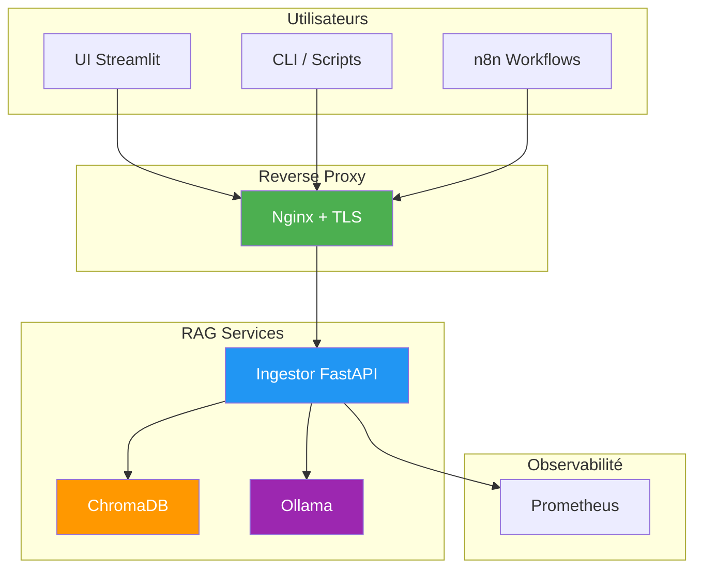
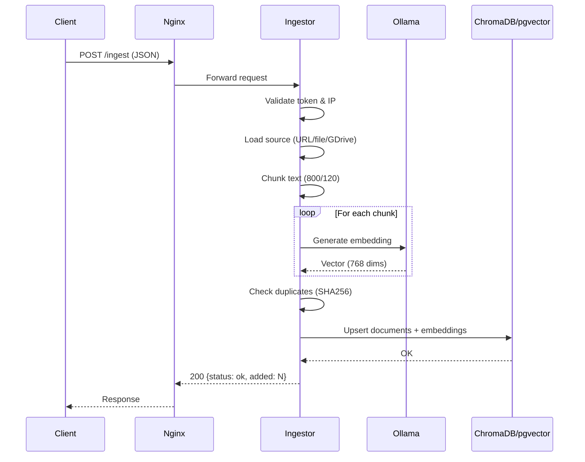
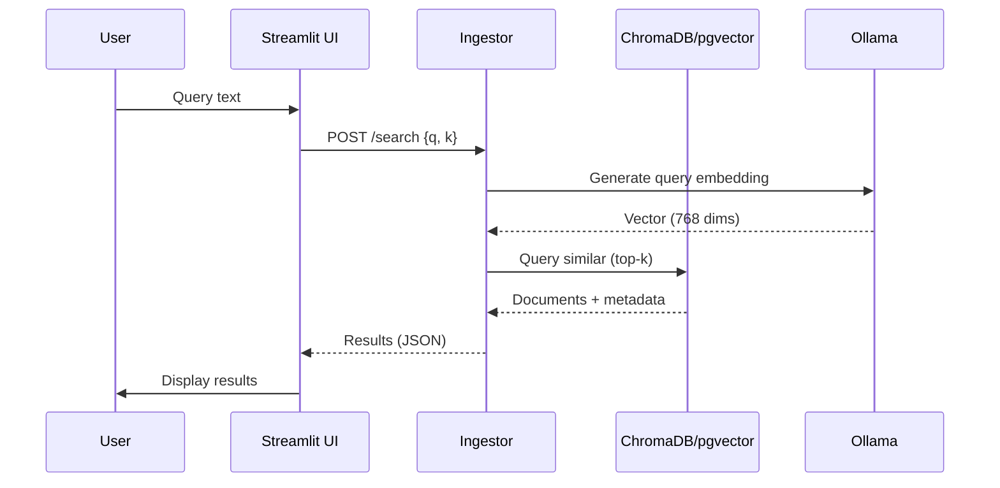
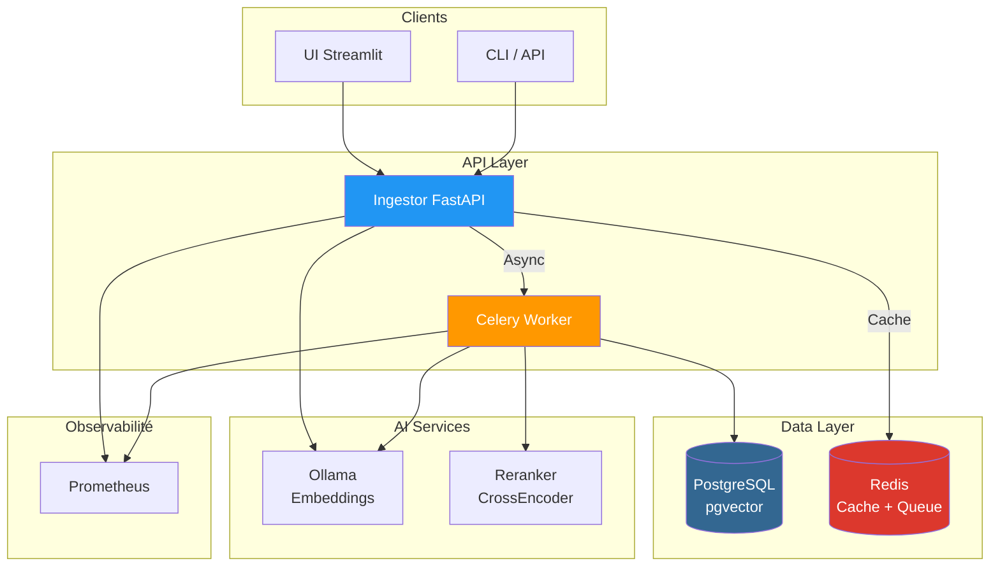
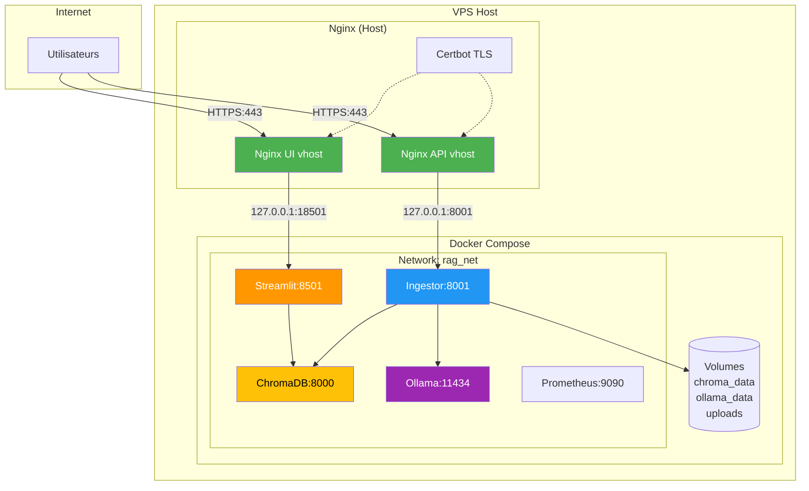
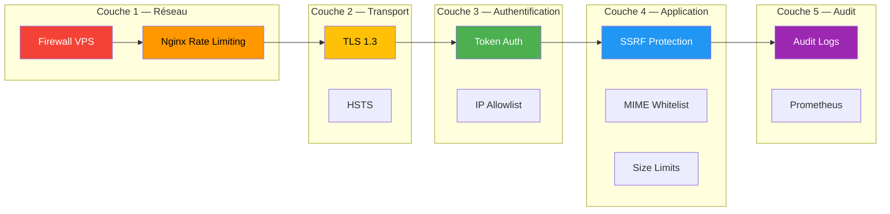
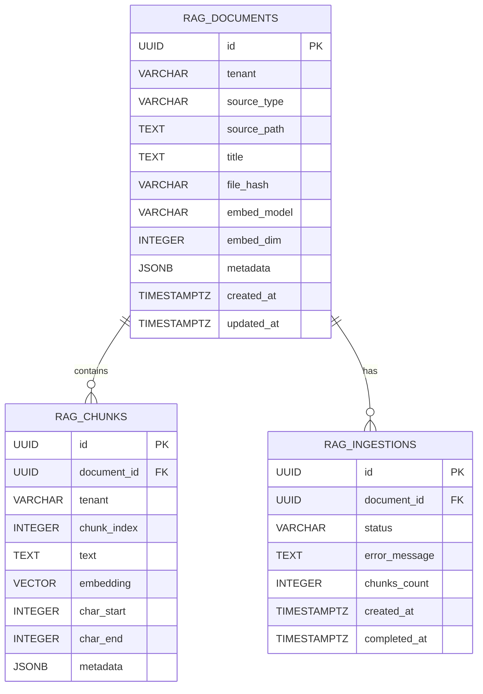

# Architecture Diagrams — rag-local

Ce document contient les diagrammes d'architecture du projet rag-local.

## Sommaire

1. [Vue d'ensemble](#vue-densemble)
2. [Flux d'ingestion](#flux-dingestion)
3. [Flux de recherche](#flux-de-recherche)
4. [Architecture v2 (pgvector)](#architecture-v2-pgvector)
5. [Déploiement production](#déploiement-production)

---

## Vue d'ensemble

---

## Flux d'ingestion

---

## Flux de recherche

---

## Architecture v2 (pgvector)

---

## Déploiement production

---

## Sécurité — Couches de défense

---

## Data Model — pgvector (v2)

---

## Références

- [docs/adr/](./adr/) — Architecture Decision Records
- [SPEC.md](../../SPEC.md) — Spécifications API
- [docs/dossier-technique-exhaustif.md](./dossier-technique-exhaustif.md) — Dossier technique
